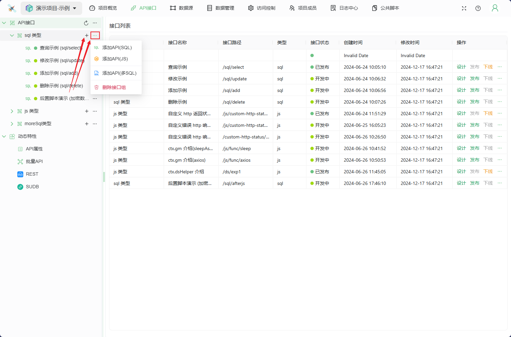
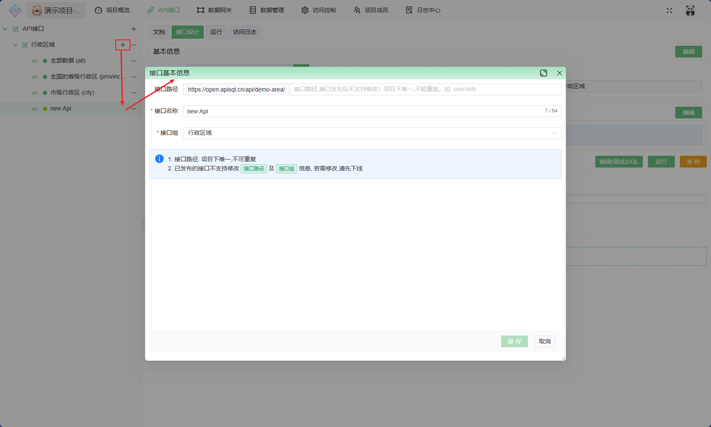

# 接口

使用 SQL 语句 与 JavaScript（js）脚本灵活、高效地定制 API

## 基本概念

* **接口运行环境**: 为了便于开发与版本迭代，接口运行环境分为 `开发环境` 与 `生产环境`
  * 开发环境: 接口未发布之前的环境，用于设计接口及初步测试
    * 设计完成后，即可将当前开发环境发布为生产环境
  * 生产环境: 接口发布后的环境，供外部访问，不支持编辑
    * 若要更新生产环境，重新编辑开发环境后再次发布即可
    * 若已存在生产环境，则不支持编辑接口的基本信息(如接口路径)，若要编辑，则需要先下线生产环境

   **接口运行环境与数据源中的多环境(若数据源启用了多环境)关联**，如接口在开发环境运行，便只能访问数据源的开发环境或默认环境配置，详情请参考 [数据源环境](../../../030@项目/0020@数据网关＆数据源.md#数据源环境)

* **接口类型**  
  * SQL 类型
  SQL 语句就是 API，简单/快速，略微了解 SQL 语言即可快速开发API
  * MoreSQL 类型
  MoreSQL 基于SQL类型, 一个 API 中可以添加多个 SQL语句,支持事务
  * JS(JavaScript) 类型
  使用 `JavaScript` 语言编写的接口，由数据网关([Node.js](https://nodejs.org/zh-cn) 环境)执行

## 新建接口

> 接口只能添加到接口组下(若无接口组，需先新建 [接口组](../../010@接口组/readme.md))

1. 进入项目后点击左侧接口组的按钮 `+` 新建 SQL类API 或点击按钮 `...` 以选择要添加的接口类型

1. 输入相关参数:
   1. 接口路径: 接口路径是指用于标识 API 资源的 URL 地址，应具备清晰的层级结构，能够清晰地表达资源之间的关系，在设计过程中还应该考虑接口的易理解性，**需注意**:
      1. 项目下接口路径唯一，不能重复!
      2. 接口路径不可包含Query参数(即 URL 中 `?` 后的参数)
   2. 接口名称: 概括性描述此接口
   3. 接口组: 接口所在的接口组，由于接口组与访问控制关联，因此变更接口组时需注意访问控制信息

