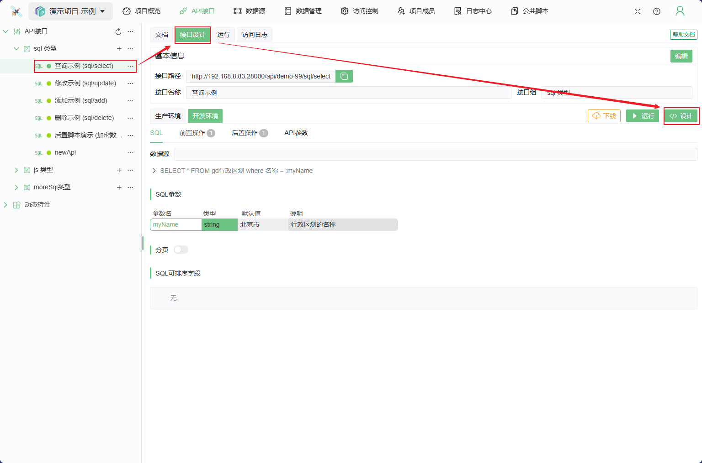
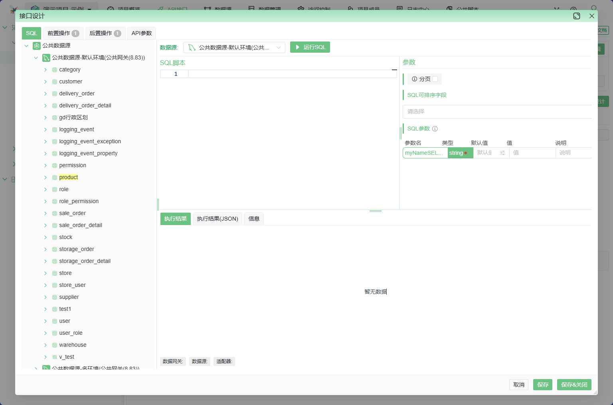
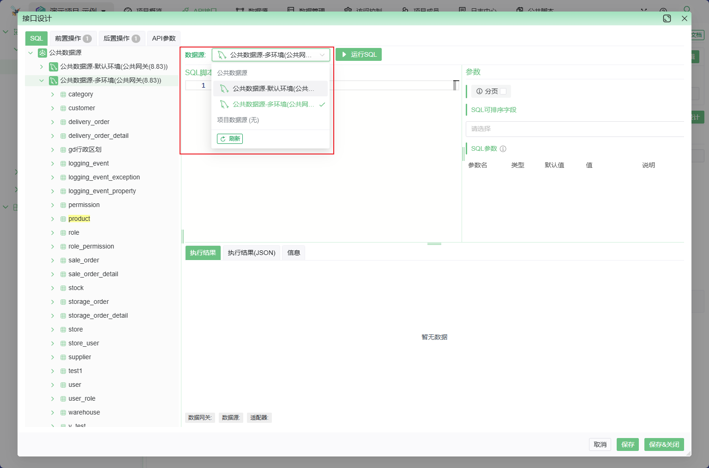
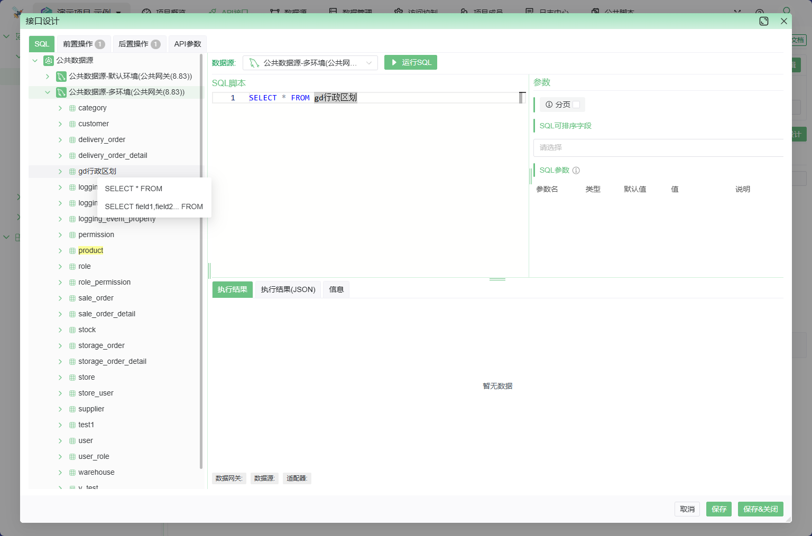
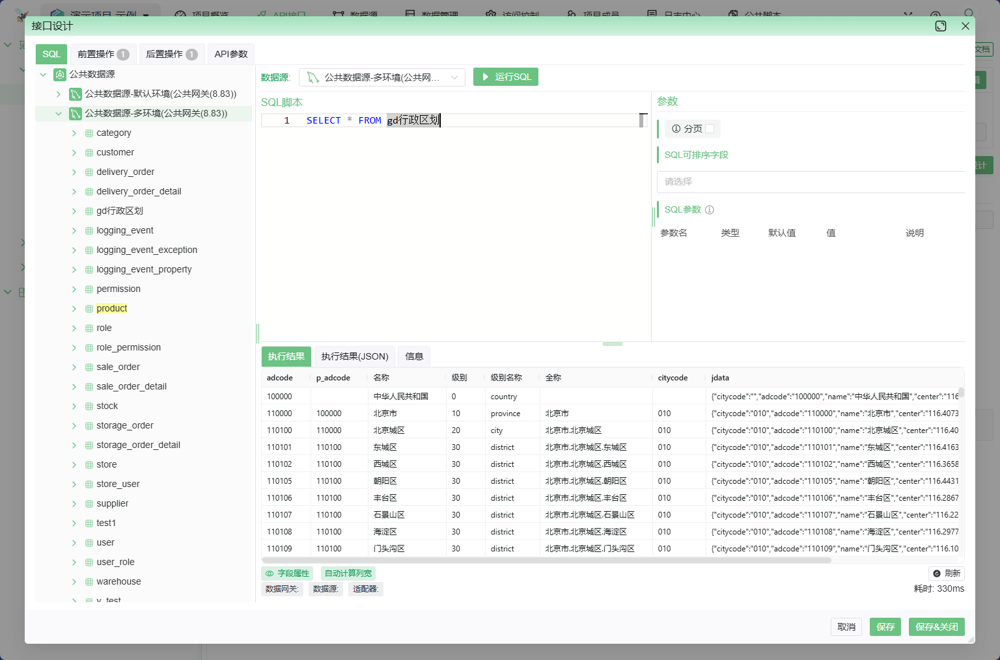
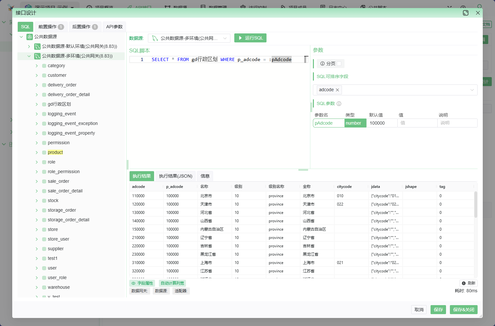

# SQL 类型接口

SQL 语句就是 API，简单/快速，略微了解 SQL 语言即可快速开发API

## 接口设计

1. 在左侧接口列表中选择要编辑的接口，然后点击标签 `接口设计`中的`设计` 按钮，此时会弹出设计界面

接口设计界面如下: 左侧为数据源列表，右上侧为接口设计界面，右下侧为SQL调试结果

2. 先选择数据源，若数据源所在网关离线，是无法在线调试的

3. 选择数据源后左侧会展开数据源详情(数据表信息)
   1. 在表上单击鼠标右键，可以选择针对此表的快速查询语句
   2. 单击数据表名称，会展开数据表的字段信息，此时可在字段名称上单击鼠标右键，选择将表名称插入到编辑器
   
4. 编写SQL 后点击 `运行SQL` 按钮 即可在线运行SQL (若是大量查询，请务必勾选 `分页`)
   关于如何编写SQL， 详见 [SQL 语句编写指南](../../../050@语法指南/0010@SQL语句.md)

5. 参数
   1. *`分页`* 功能:  
      1. **若SQL不是查询语句，请勿勾选**(否则会出现异常);
      2. 若查询结果是大量多行数据时，**请务必勾**选此项以启用分页功能，以避免数据量过大影响效率
   2. 可排序字段: 定义支持的排序字段，接口请求时可以通过参数实现动态排序
   3. SQL参数: 根据 SQL 语句自动生成的动态参数，基本属性有:
      1. 类型: 可用于校验在接口调用时 http 请求中所携带参数的数据类型，若不匹配，会返回异常
      2. 默认值: 若接口调用时 http 请求中未携带此参数，则使用默认值
      3. 值: 当前调试时使用的值
      4. 说明: 可以写点描述，提高 SQL 查询的可读性和可维护性
6. 接口设计完成后 点击下方的保存按钮即可

* 支持前后置操作,详细示例请参考[前后置操作](../../../040@前后置操作/010@功能简介/功能简介.md)
