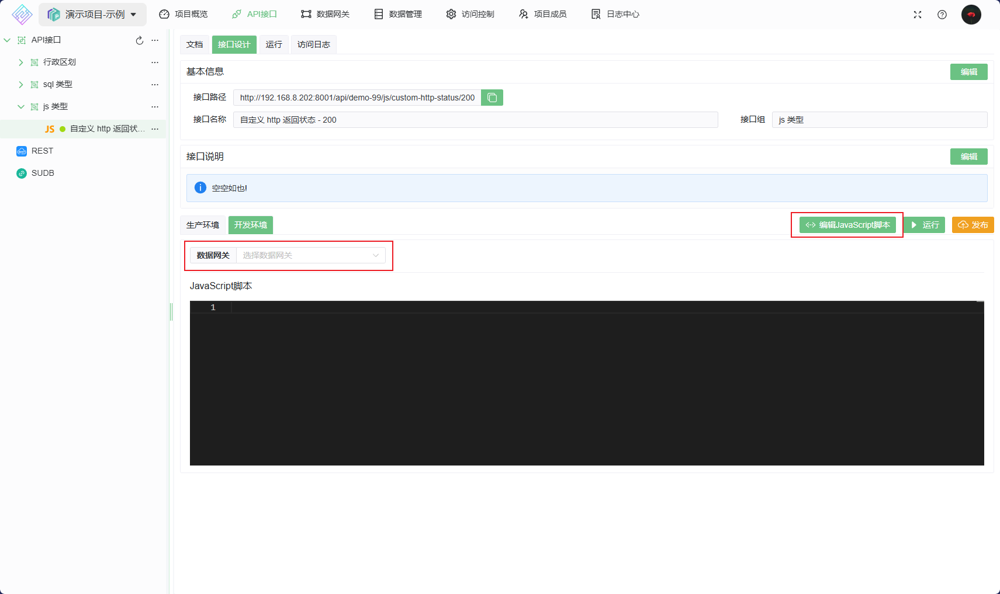
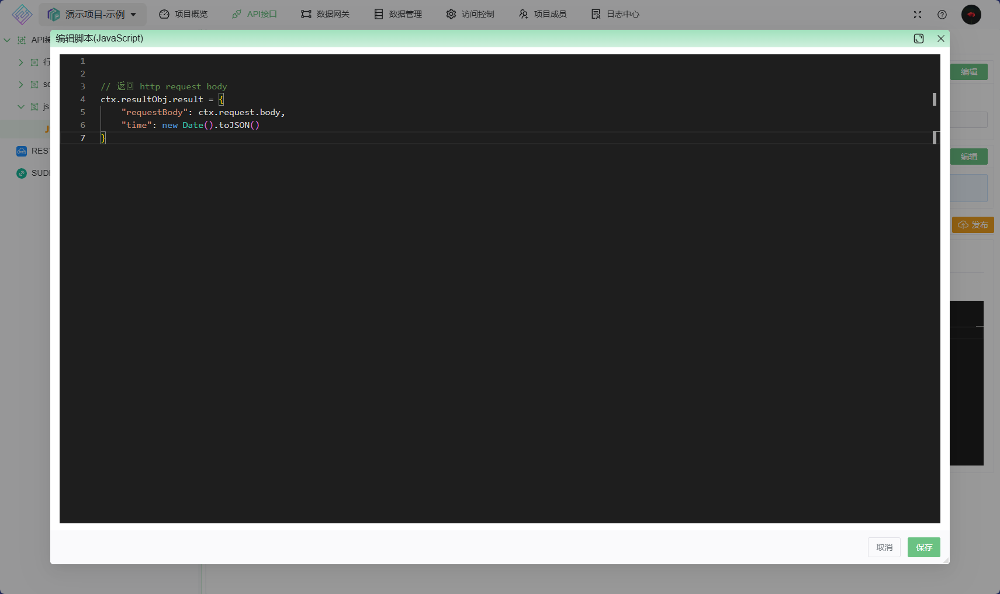

# JS(JavaScript) 类型接口

使用 `JavaScript` 语言编写的接口，由数据网关([Node.js](https://nodejs.org/zh-cn) 环境)执行

## 接口设计

1. 先选择数据网关: 指定此脚本在哪个数据网关上执行
2. 点击 开发环境中的 `编辑JavaScript脚本` 按钮，开始编辑
    
3. 开始编写脚本，完成后点击下方的保存按钮，然后就可以运行/调试了
    

如何快速开发 JS API ，请参阅 [JS API 脚本编写指南](../../../050@语法指南/0020@JSAPI脚本指南.md)
