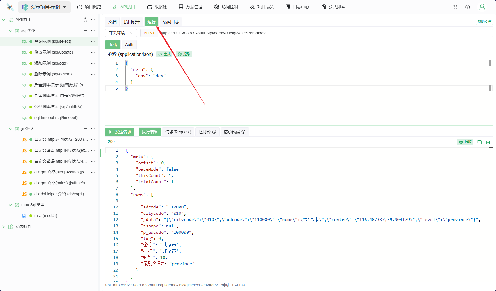
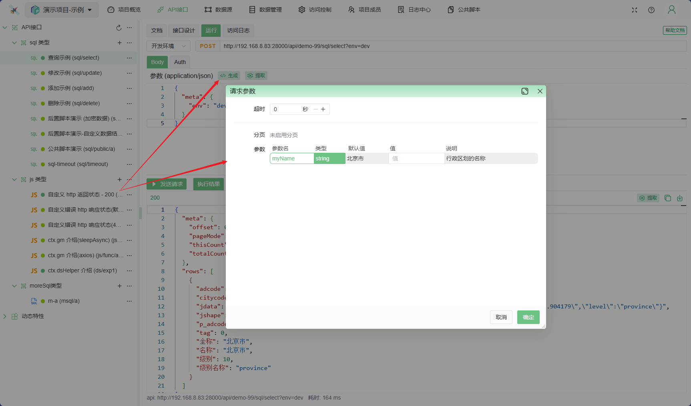
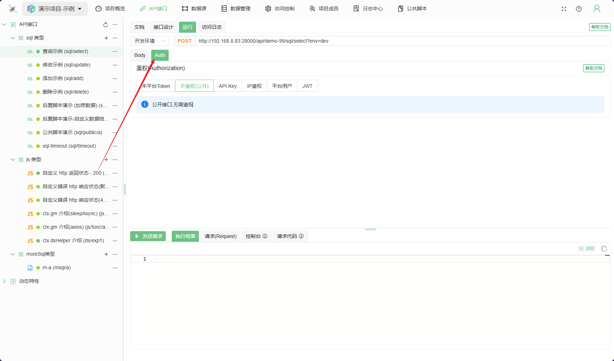
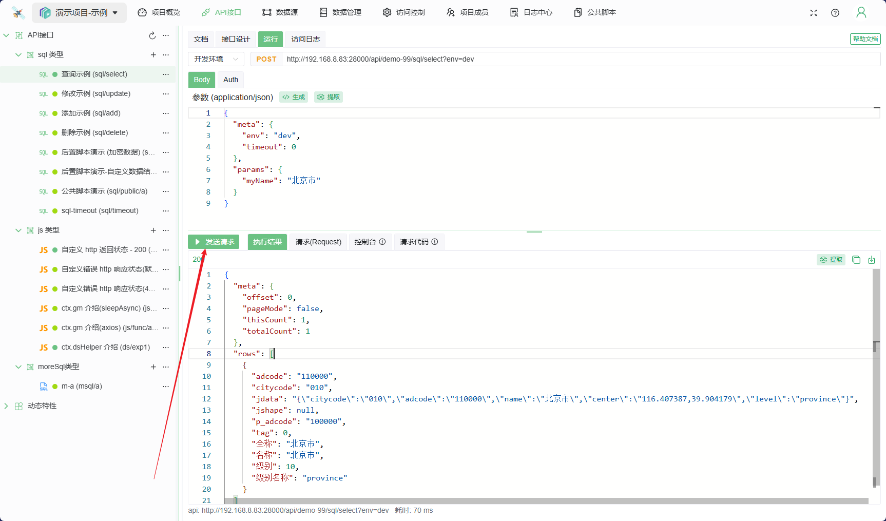

# 接口运行(调试)

接口调试，即在开发与测试环节针对接口发起请求，其核心用途是助力开发人员精准定位、迅速修复代码漏洞。

* **区分生产环境与开发环境**

## 步骤如下

1. 选择接口，并切换到接口的 `运行` 页。

1. 点击参数栏 `生成` 按钮，即可根据接口设计信息动态生成参数,方便快速调试。

1. Authorization 鉴权: 如果接口需要鉴权，则需要先在 `Auth` 页面中配置鉴权信息

1. 点击 `运行` 按钮，即可发起请求，并返回结果。


## 请求参数

http请求的 body 参数是 json 格式。不同的接口类型,参数格式略有不同

### SQL类型

```json
{
  // meta 中定义了接口的元数据信息
  "meta": {
    "env": "dev",   // env=='dev',表示开发环境,其它情况均为生产环境
    "timeout": 0,   // 超时时间, 单位秒,默认 30s
    // pageNum,pageSize 分页信息: 需在接口设计时先启用分页,否则无效
    "pageNum": 1,    
    "pageSize": 10,  
    // sort 排序字段: 需在接口设计时先定义可排序字段,否则无效
    "sort": [
      {
        "value": "adcode",  // 排序字段
        "isAsc": true       // 是否升序 
      }
    ]
  },
  // sql的参数
  "params": {
    "myName": "北京市"
  }
}
```

### MoreSQL类型

```json
{
  "meta": {
    "env": "dev",   // env=='dev',表示开发环境,其它情况均为生产环境   
    "tran": false, // 是否开启事务: 默认不开启
    "timeout": 0,   // 超时时间, 单位秒,默认 30s
},
// paramArray: 多个参数的集合, 默认为空数组,按照顺序与设计的 多sql 对应 
"paramArray": [
    // item 中 meta的信息 SQL类型中的meta一致, 但不支持 `timeout`, 详见SQL类型中关于meta参数说明
    // item 中 params的信息 SQL类型中的params一致, 详见SQL类型中关于params参数说明
    {
      "meta": {
        "pageNum": 1,
        "pageSize": 10,
        "sort": [
          {
            "value": "id",
            "isAsc": true
          }
        ]
      },
      "params": {
        "mxId": "10"
      }
    },
    {
      "meta": {},
      "params": {}
    }
  ]
}
```

### JS 类型

```json
{
  // meta 中定义了接口的元数据信息
  "meta": {
    "env": "dev",   // env=='dev',表示开发环境,其它情况均为生产环境
    "timeout": 0,   // 超时时间, 单位秒,默认 30s
  },
  // 除meta外, 无固定参数   
}
```
