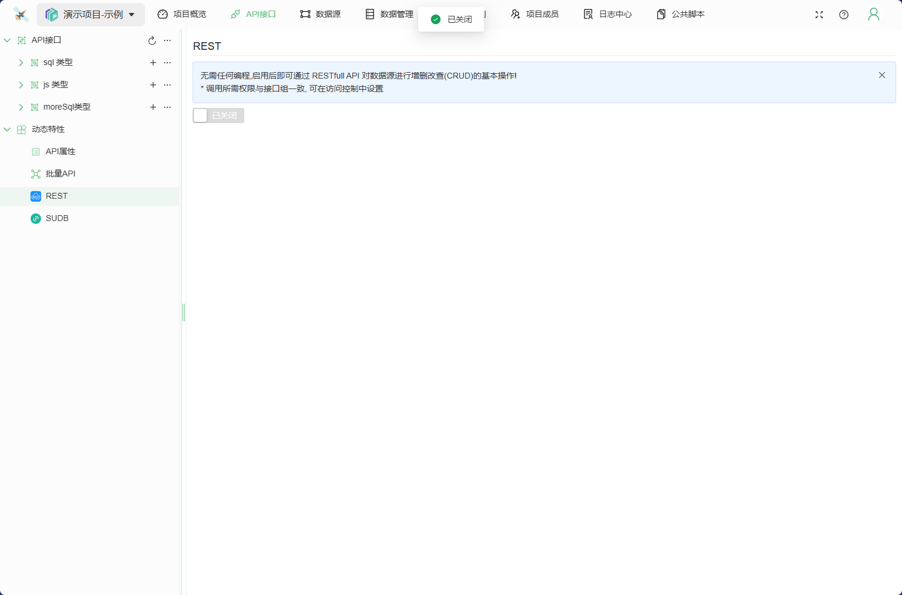
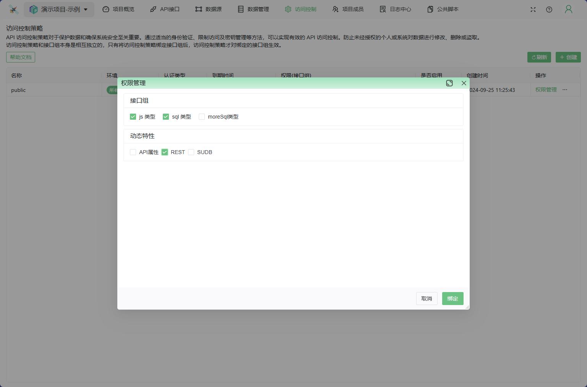
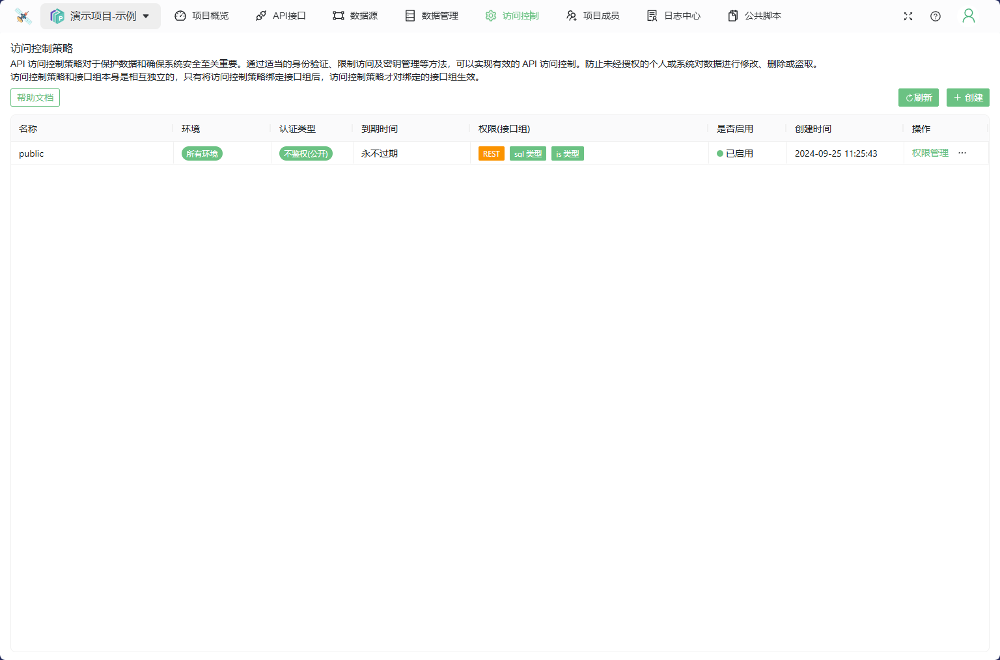
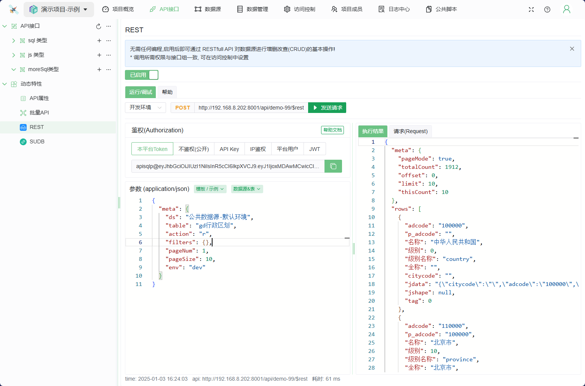
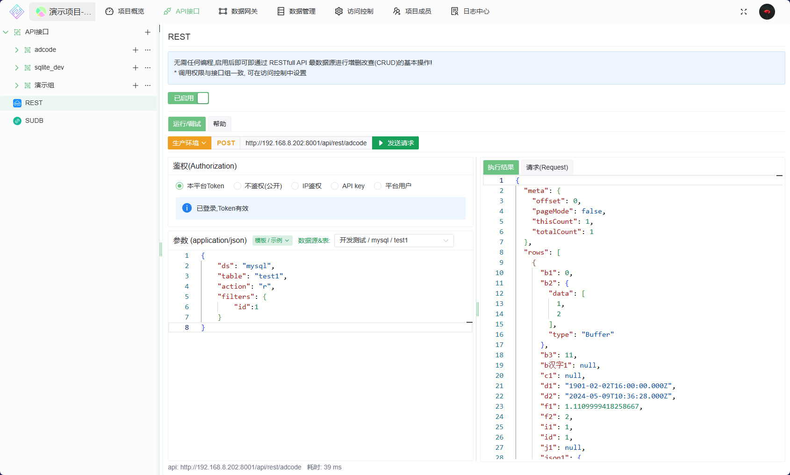
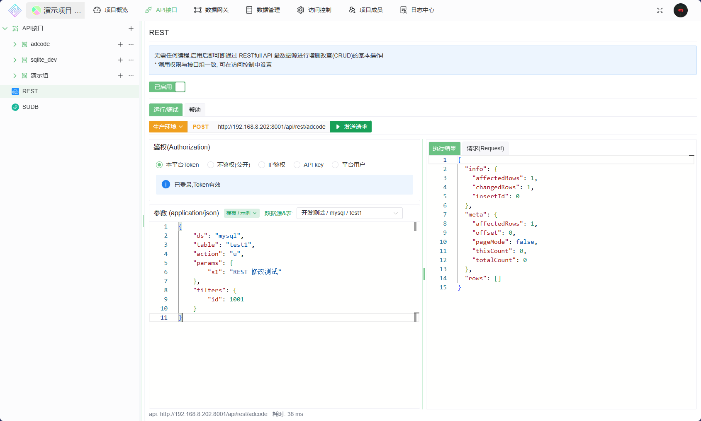
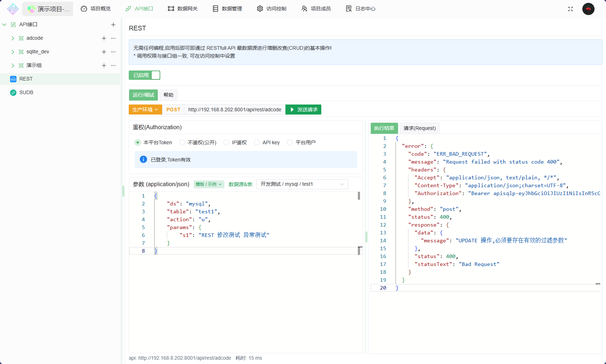
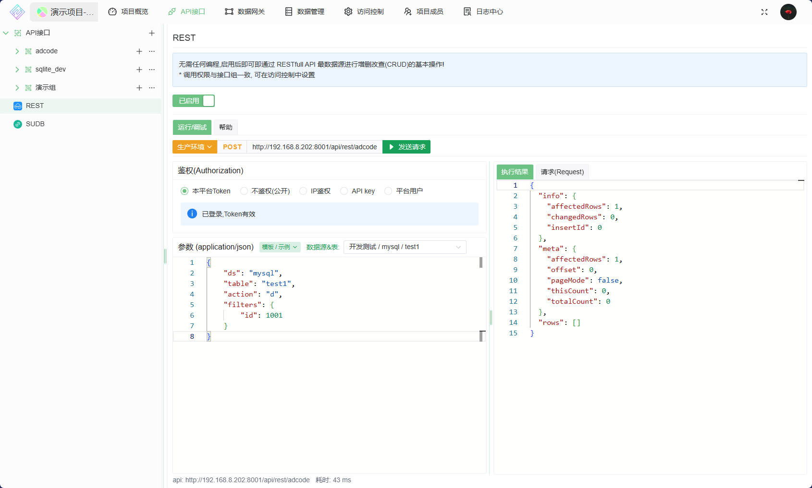

# REST

无需任何编程,启用后即可通过 RESTfull API 对数据源进行基本的增删改查(CRUD)基本操作!

* 告别枯燥无味的增删改查SQL语句
* 更加专注业务,节约大量成本,提高工作效率

## 局限性

1. 为了使用简便, 目前只支持单表操作
2. 不支持事务/多表等
3. 不支持复杂的查询
4. 为了数据安全,不支持全局删除/修改, 当执行不带任何条件的删除/修改时会抛出异常

## 开始

> 安装网关并添加一个数据源

### 1. 启用REST功能

1. 启用
    
2. 访问权限
   1. 开发环境支持使用`本平台Token`访问(可在项目设置中开启)
   2. 在访问策略的`权限管理`中设置某个策略的访问权限, 打开 `REST` 开关即可
    
   3. 开启后可以在 权限中看到 `REST`的标记
   

### 3. 使用

快速编写API


#### 参数说明

body参数说明

```json
{
    "meta": {
        "ds": "", // string, 数据源名称: 表示此次执行的目标数据源
        "table": "", // string, 数据表的名称
        "action": "", // string, 动作: 支持 'c'|'r'|'u'|'d', CURD(Create, Update, Retrieve, Delete) 
        "fields": "id,age", // string, action == 'r' 有效, 指定返回字段,多个字段直接用逗号(",")间隔 
        //filters , SQL 过滤条件, action='r'|'u'|'d' 有效; action ='u'|'d' 时为必要参数,以避免直接操作整张表
        //SQL 解析时多个条件间, 会使用 'AND' 连接 
        "filters": {},

        "pageSize": 30, // 分页 每页大小, action == 'r' 有效
        "pageNum": 1, // 分页 当前页码, action == 'r' 有效
    },
    // Record<string,any>, action='c'|'u' 有效, 表示要 写入/修改 的字段信息, object 的key就是表的字段名称,value为值
    "params": { // 值  Create, Update 有效
        "id": 1,
        "name": 2
    },
} 
```

#### 示例

在平台登录后, `项目=>数据源`, 即可查看数据源是否启用了多环境

* 数据源未启用多环境,参数 `dsEnv` 无意义, 省略即可

1. 查询

   ```js
   // 查询数据源 'mysql' 下表 'test1' 中 id =1 的数据
   const body={
       "ds": "mysql",
       "table": "test1",
       "action": "r",
       "filters": {
           "id":1
       }
   }
   ```

   
2. 分页查询

   ```js
   // 分页查询 数据源 'mysql' 下表 'test1'  的数据
   const body={
       "ds": "mysql",
       "table": "test1",
       "action": "r",
       "filters": {},
       "pageNum": 1,
       "pageSize": 10
   }
   ```

   
3. 添加一条数据

   ```js
   // 添加一条数据到 数据源 'mysql' 下表 'test1'  中
   const body={
       "ds": "mysql",
       "table": "test1",
       "action": "c",
       "params": {
           "id": 1001,
           "s1": "rest insert 测试"
       }
   }
   ```

   
4. 修改一条数据

   ```js
   // 修改 数据源 'mysql' 下表 'test1'  中 id =1001 的数据
   // 注意, 若 filters 为空 会提示异常的
   const body={
       "ds": "mysql",
       "table": "test1",
       "action": "u",
       "params": {
           "s1": "REST 修改测试"
       },
       "filters": {
           "id": 1001
       }
   }
   ```

   
   *filters 异常:*
   
5. 删除一条数据

   ```js
   // 删除 数据源 'mysql' 下表 'test1'  中 id =1001 的数据
   // 注意, 与修改 一样, 若 filters 为空 会提示异常的,
   const body={
       "ds": "mysql",
       "table": "test1",
       "action": "d",
       "filters": {
           "id": 1001
       }
   }
   ```

   

6. 更多玩法

   ```js
   // 实例: 数据源 `mysql` 中有张用户表(user), 其中有字段 id(int),name(varchar),age(int) 

   // 1. 获取 'user'表 中 id = 1 且 name='张三' 用户的 age 信息
   const body={
       "ds": "mysql",
       "table": "user",
       "action": "r",
       "filters": {
           "id":1,
           "name":"张三"
       },
       "fields":"age"
   }

   // 2. 获取 'user'表 中 age = 18 的用户, 指定返回字段 `id,name` ,且只返回 前 100 条数据
   const body={
       "ds": "mysql",
       "table": "user",
       "action": "r",
       "fields":"id,name",
       "filters": {
           "age": 18
       },
       "pageNum": 1,
       "pageSize": 100
   }
   
   ```
