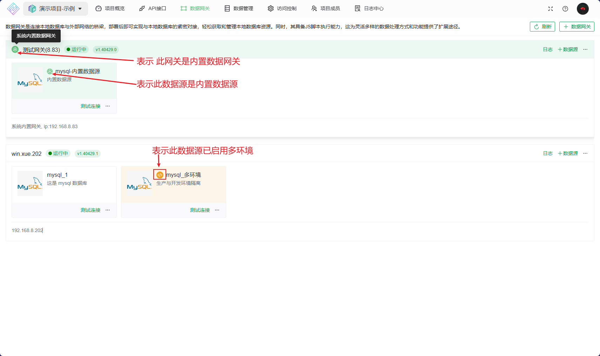
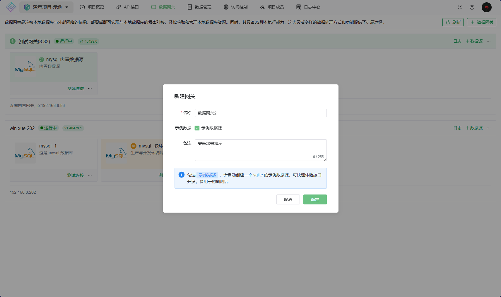
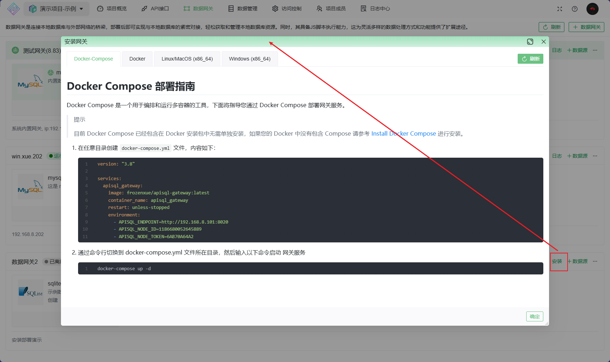
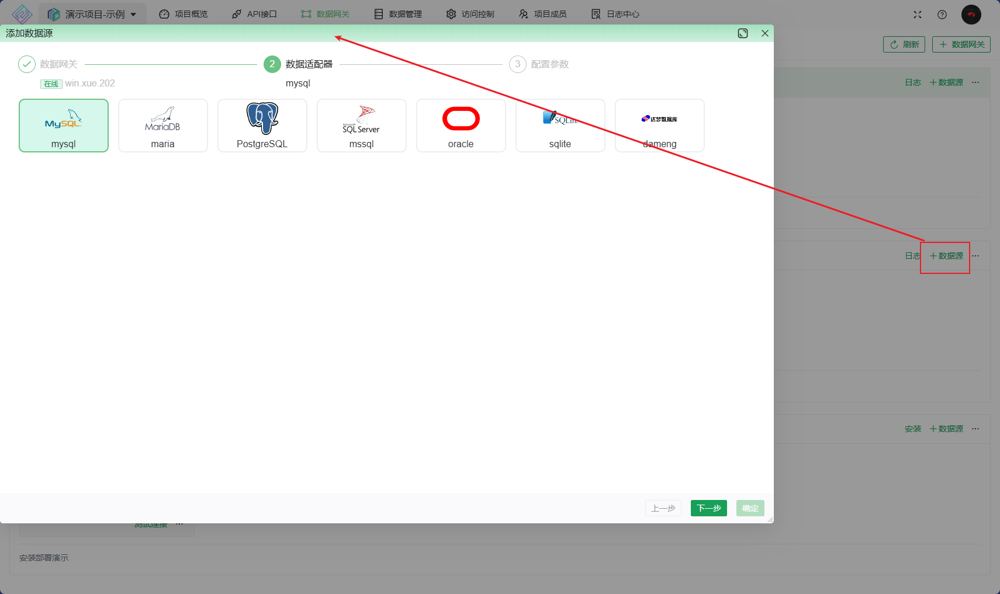
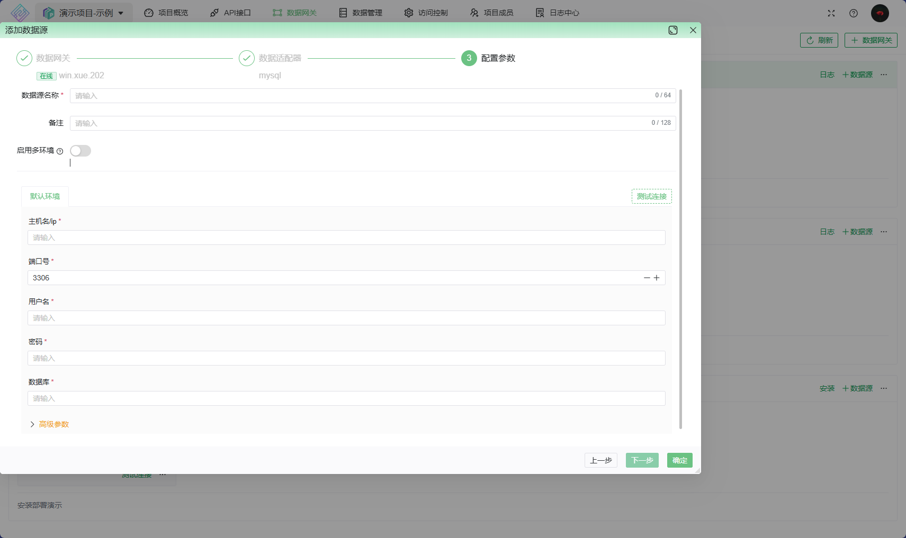
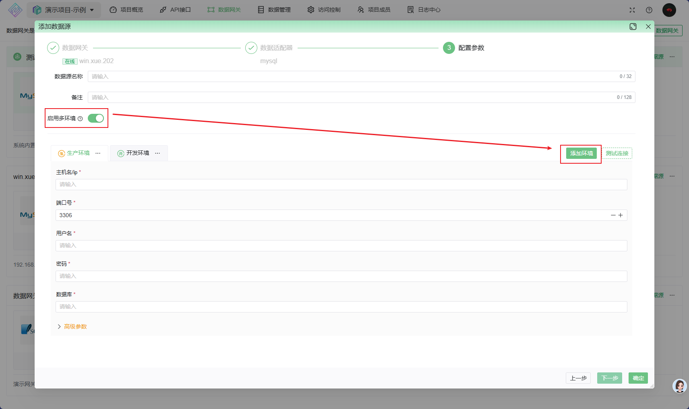

# 数据网关&数据源

## 数据网关

数据网关是连接本地数据库与外部网络的桥梁，部署后即可实现与本地数据库的紧密对接，轻松获取和管理本地数据库资源。同时，其具备JS脚本执行能力，这为灵活多样的数据处理方式和功能提供了扩展途径。

数据网关依托于项目，是创建在项目下的

* **核心功能**
  * 本地数据库连接：能够轻松连接本地数据库，确保数据的安全与稳定访问。
  * 脚本执行能力：支持执行 JS 脚本，满足各种个性化业务需求。
  * 公网相通：实现与公网的顺畅连接，让私有网络数据能与互联网进行高效交互。
  * 数据透明：在 Apisql 上设计的接口，均在本地网关上执行，数据透明/安全。
* **系统内置数据网关**
  由系统内部提供的数据网关，方便快速体验。用户可以在自己的项目中，可以将数据源(公网可访问，如云数据库)添加到此网关下进行快速体验

### 添加数据网关

若勾选示例数据源，会自动创建一个 sqlite 的示例数据源，方便快速体验

### 安装部署

选择适合自己的部署方案，推荐 Docker compose

## 数据源

数据源用于连接不同的数据存储服务。在设计API之前，需要先配置数据源信息，以便在设计API时，能够使用数据源基本信息，完成快速设计

一个网关下可以添加多个数据源

### 数据源环境

#### 未启用多环境

一个数据源就一个默认环境，无法设置开发环境和生产环境隔离，只能进行简单的数据开发，适合测试或简单场景使用 。

#### 已启用多环境

启用多环境后,在配置数据源时，您可基于具体使用场景，针对不同环境设置不同的数据源信息。
为了简单易用,我将环境整体分为两类,分别是 `开发环境`与`生产环境`,详情如下:

1. 生产环境: 与接口运行环境的生产环境相对应, 数据源可以添加**多个开发环境**,但这样就需要在接口调用时指定具体使用哪个开发环境
2. 开发环境: 与接口运行环境的开发环境相对应,只能有一个开发环境

关于接口运行环境, 详见 [接口运行环境](../020@接口开发指南/020@接口/010@接口介绍/readme.md#基本概念)

**注意:**

1. 对于 `SUDB` 及 `REST` 类型的接口，是没有 `接口运行环境` 概念的，您需要在接口调用参数中明确指定此次请求所使用的环境，详见 [SUDB](../020@接口开发指南/030@动态特性/0040@SUDB.md)，[REST](../020@接口开发指南/030@动态特性/0030@REST.md) 中多环境的使用描述
2. 为了数据安全，在接口开发过程中，数据源的一切信息均来自其 `开发环境` ，如在调试SQL语句时看到的表信息，返回的数据等
3. 需特别注意 [数据管理功能](./0040@数据管理.md)，此功能可以访问所有环境下的数据，并提供了执行SQL脚本的能力

### 添加数据源

网关必须在线

1. 点击添加数据源按钮，然后选择数据适配器
   
1. 数据适配器选择后，需要填写数据库的连接参数
   1. 数据源名称: 全局唯一，不能重复，在 [SUDB](../020@接口开发指南/030@动态特性/0040@SUDB.md)，[REST](../020@接口开发指南/030@动态特性/0030@REST.md) 接口中会使用
   
   2. 启用多环境后即可添加不同环境的数据库连接配置
   
