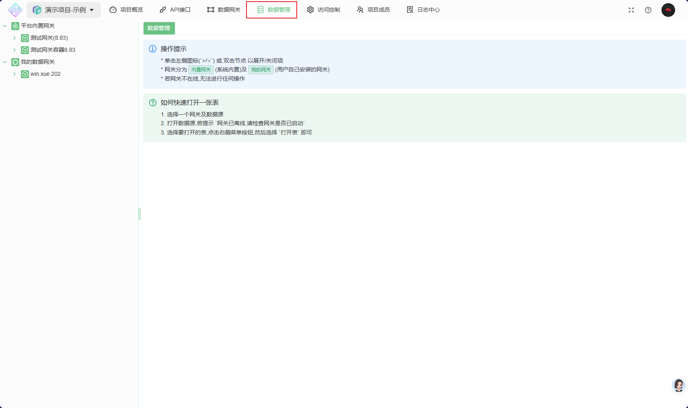
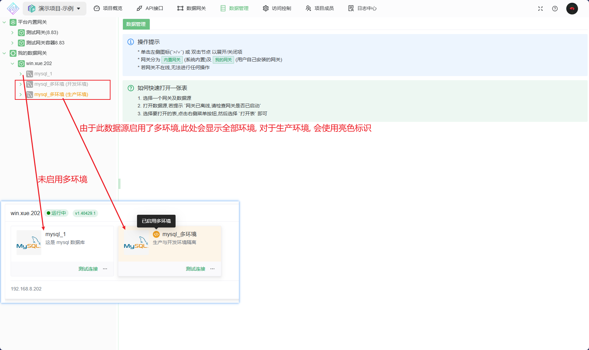
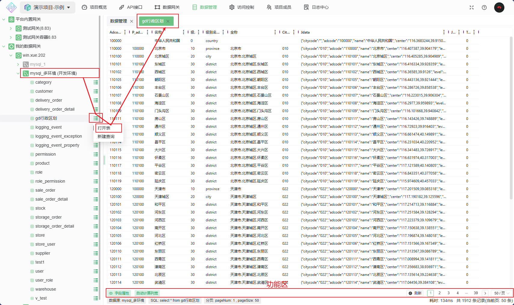
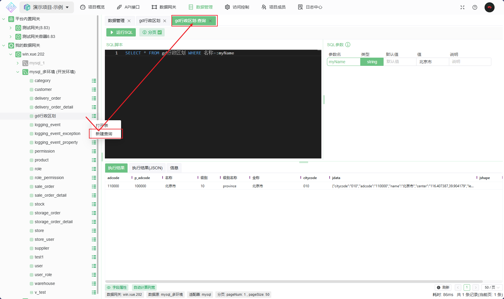

# 数据管理

快速查看数据源数据，并提供了执行SQL脚本的能力

## 使用

1. 先打开项目并切换到 `数据管理` 菜单，现在可以看到左侧已经列出了网关及网关下的数据源信息

2. 双击网关即可展开网关下的数据源列表(若有数据源)，若项目下无自己部署的网关，可以用平台网关体验
   1. 对于已启用多环境的数据源，会显示所有环境，**请谨慎操作生产环境**

3. 选择一个数据源，此时会加载数据源的表结构信息
   1. 在要打开表的菜单按钮上选择 `打开表`操作，会打开表数据浏览窗口
   
   2. 在要打开表的菜单按钮上选择 `新建查询`操作, 会打开 SQL 查询窗口
      1. 编写SQL脚本, 脚本编写参见 [SQL语句编写指南](../020@接口开发指南/050@语法指南/0010@SQL语句.md)
      2. 脚本编写时会自动根据 `命名参数` 动态生成 SQL参数, 调用时请赋值
   
