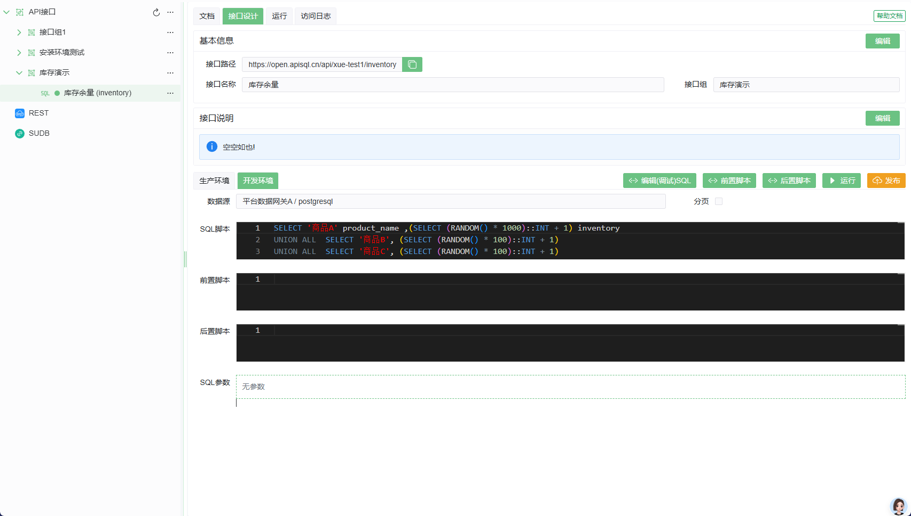
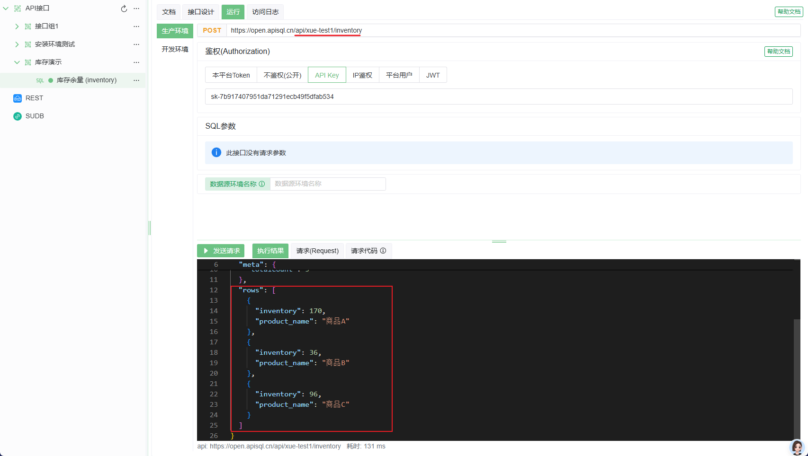
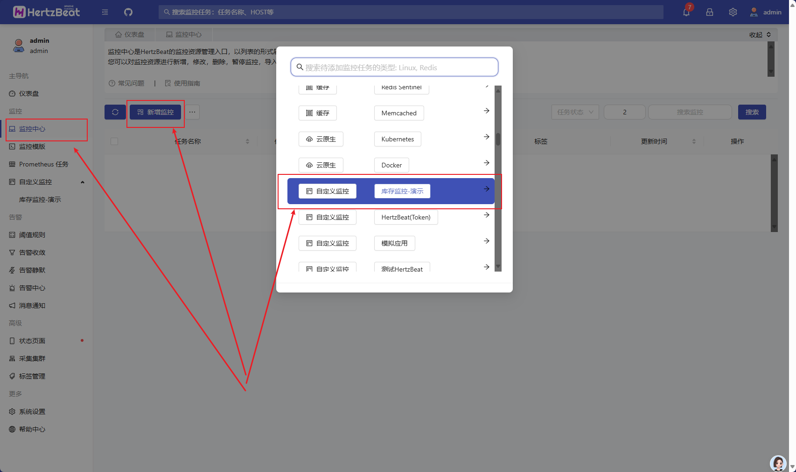
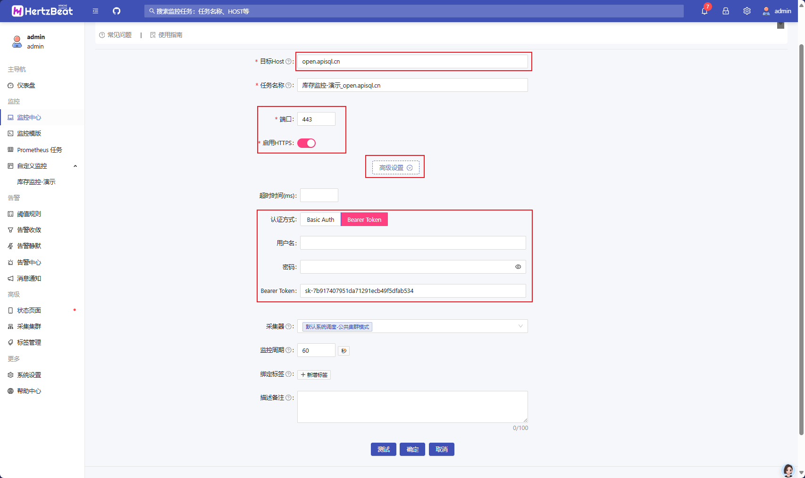
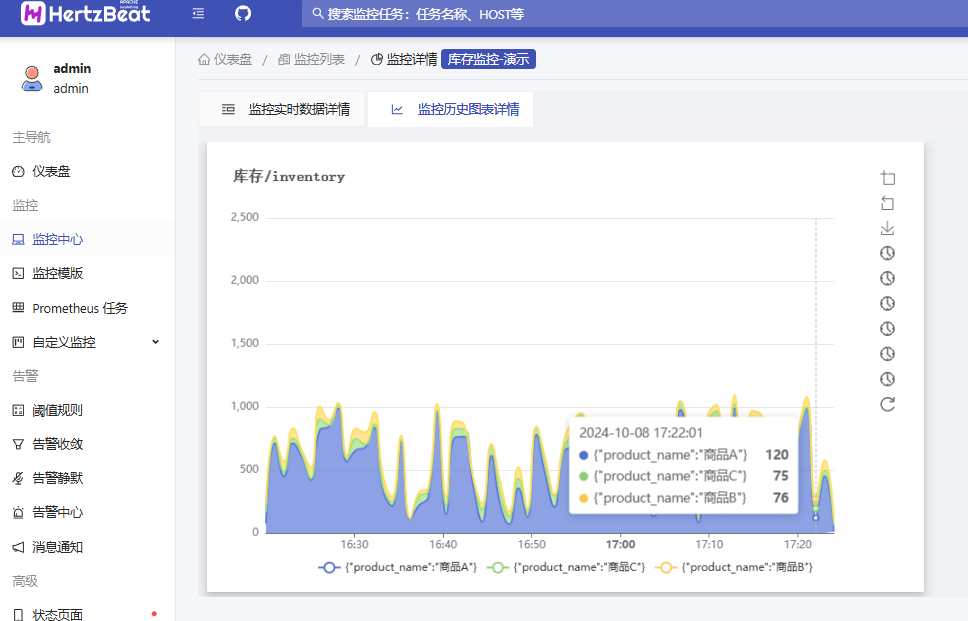

# apiSQL 与 HertzBeat(实时监控告警)的零代码实现

环境准备: 需要先自行部署 HertzBeat 系统, 详见 [HertzBeat](https://hertzbeat.apache.org/zh-cn/)

设计目标:

1. 目前有一个库存系统, 需要监控商品的库存, 当库存余量不足时自动告警+通知

## 1. 先通过 apiSQL 平台设计一个可以获取库存数据的api

### 伪SQL如下

```sql
SELECT '商品A' product_name ,(SELECT (RANDOM() * 1000)::INT + 1) inventory
UNION ALL  SELECT '商品B', (SELECT (RANDOM() * 100)::INT + 1)
UNION ALL  SELECT '商品C', (SELECT (RANDOM() * 100)::INT + 1) 
```



### 接口执行结果



* **注意接口的访问权限**,此示例使用了 `apiKey`, 可以先设置为 `不鉴权`, 待调试结束后在设置为需要的鉴权方式,详见 [访问控制](../030@项目/0010@访问控制.md)

## 2. HertzBeat 中新增一个自定义的HTTP协议监控模板
>
> 参考: <https://hertzbeat.apache.org/zh-cn/docs/advanced/extend-http-example-hertzbeat>

可以直接复制以下模版YML并添加

1. 参数解释:
   1. `url`: 修改为上一步中设计的api地址(相对地址)
   2. `parseScript`:是上一步中设计的api返回的数据结构, 一般为 `{rows:[{...}]}`

```yaml
# 请在此通过编写YML内容来定义新的监控类型, 参考文档: https://hertzbeat.apache.org/docs/advanced/extend-point 
category: custom
# The monitoring type eg: linux windows tomcat mysql aws...
app: 库存监控-APISQL
name:
  zh-CN: 库存监控-APISQL
help:
  zh-CN: 库存监控-APISQL,演示模板
params:
   - field: timeout
    name:
      zh-CN: 超时时间(ms)
      en-US: Timeout(ms)
    type: number
    required: false
    hide: true
  - field: authType
    name:
      zh-CN: 认证方式
      en-US: Auth Type
    type: radio
    required: false
    hide: true
    options: 
      - label: Basic Auth
        value: Basic Auth
      - label: Bearer Token
        value: Bearer Token
  - field: username
    name:
      zh-CN: 用户名
      en-US: Username
    type: text
    limit: 50
    required: false
    hide: true
  - field: password
    name:
      zh-CN: 密码
      en-US: Password
    type: password
    required: false
    hide: true
  - field: bearerToken
    name:
      zh-CN: Bearer Token
      en-US: Bearer Token
    type: text
    limit: 128
    required: false
    hide: true 
metrics:
  # the first metrics summary
  # attention: Built-in monitoring metrics contains (responseTime - Response time)
  - name: 库存信息
    # metrics scheduling priority(0->127)->(high->low), metrics with the same priority will be scheduled in parallel
    # priority 0's metrics is availability metrics, it will be scheduled first, only availability metrics collect success will the scheduling continue
    priority: 0
    # collect metrics content
    fields:
      # metrics content contains field-metric name, type-metric type:0-number,1-string, instance-if is metrics, unit-metric unit('%','ms','MB')
    #   - field: 商品名称
      - field: product_name
        type: 1
        label: true
    #   - field: 库存余量
      - field: inventory
        type: 0 
    #  the protocol used for monitoring, eg: sql, ssh, http, telnet, wmi, snmp, sdk, we use HTTP protocol here
    protocol: http
    # the config content when protocol is http
    http:
      # host: ipv4 ipv6 domain
    #   host: ^_^host^_^
      # http port
    #   port: ^_^port^_^
      # http url, we don't need to enter a parameter here, just set the fixed value to /api/summary
      # 设置获取数据的 api  https://open.apisql.cn/api/xue-test1/inventory
      url: https://open.apisql.cn/api/xue-test1/inventory
      timeout: ^_^timeout^_^
      # http method: GET POST PUT DELETE PATCH, default fixed value is GET
      method: POST
      # if enabled https, default value is false
      ssl: ^_^ssl^_^
      # http auth
      authorization:
        # http auth type: Basic Auth, Digest Auth, Bearer Token
        type: ^_^authType^_^
        basicAuthUsername: ^_^username^_^
        basicAuthPassword: ^_^password^_^ 
        bearerTokenToken: ^_^bearerToken^_^
      # http response data parse type: default-hertzbeat rule, jsonpath-jsonpath script, website-for website monitoring, we use jsonpath to parse response data here
      parseType: jsonPath
      parseScript: '$.rows.*'

```

## 3. HertzBeat 中新增一个监控

在监控中心中使用刚刚添加的模板新建监控


* 参数:
  * 启用https,端口为443
  * 高级设置中设置认证方式,根据第一步中设计的接口的认证方式配置此处,
    * 若是 `不鉴权`,此处则无需设置
    * 若是 `apiKey`,此处使用 `Bearer Token`(示例中使用的就是此认证)


点击测试,即可已验证设置是否有效,保存此监控后即可基于此监控去设置阈值规则及告警

监控结果

