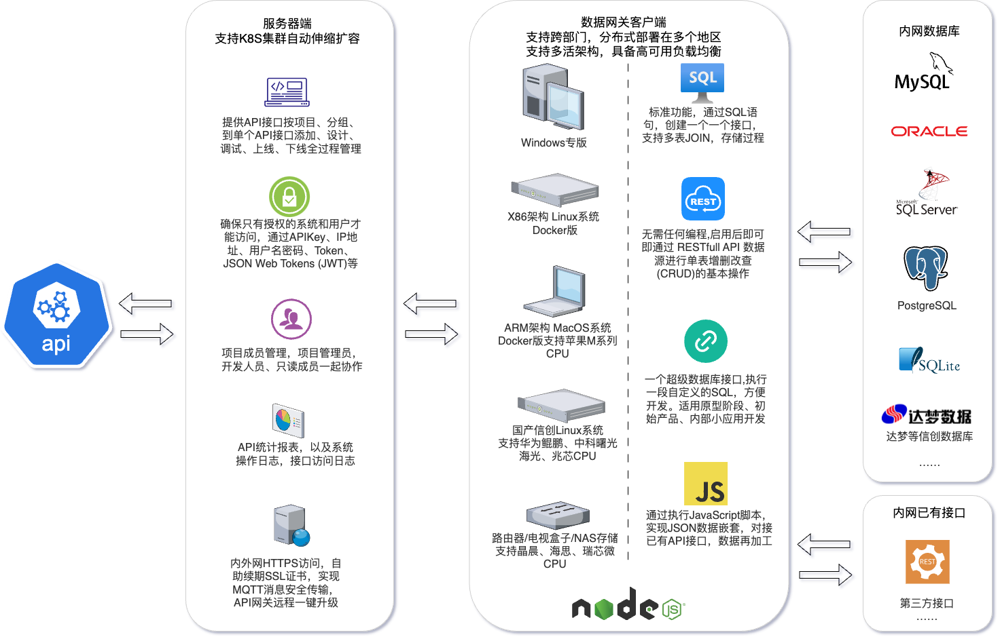

# apiSQL简介

  快速将数据库封装成REST API 和 MCP Server，代理任意 API 并实现企业级安全防护

## 核心功能

⭐ **快速开发**： 将数据库增删改查/视图/存储过程直接发布为HTTPS API

⭐ **脚本扩展**： 支持通过前置JS脚本进行请求预处理，后置脚本实现响应二次加工

⭐ **混合架构**： 既能对接数据库，也可代理已有第三方API实现统一管理

⭐ **企业级安全**： 集成IP白名单、AK/SK密钥、Token令牌、JSON Web Token（JWT）认证等

⭐ **云原生架构**： 服务端基于K8S实现自动伸缩扩容，流量高峰自动扩展Pod资源

⭐ **分布式架构**： 客户端跨地区分布式部署数据网关，支持多活架构与智能负载均衡

⭐ **国产化适配**： 支持华为openEuler、统信UOS、麒麟等信创操作系统及国产服务器硬件

APISQL系统架构示意图

 
 

## 应用场景

### 政企应用集成

✔️ ​**企业级系统互联**
企业内部ERP/OA/CRM/HR/WMS之间的快速集成，企业SCM系统与上下游ERP跨国集成，支持API传多个参数、运行多步SQL事务，请求多次预处理和响应多步加工等。

✔️ **智慧校园统一数据开放平台**
围绕API“发布-管理-分享-监控”，提供全面、权威的数据资源，涵盖人事、财务、科研、资产、教务、研究生、学工、就业、图书、宿舍等系统接口，高效服务全校师生和职能部门。

✔️ **药品流向数据跨地区获取**
支持跨地区、分布式API网关，及时获取到各地医药批发、零售药店的药品流向数据，提升制药厂和药品经营监管单位的效率。

✔️ **跨系统数据同步**
内网ERP订单、MES生产物料主数据、物流发货情况数据同步提交至明道云API和其他电商SaaS软件API。

✔️ **数据大屏API开发**
为数据大屏提供快速公网可访问的API，例如对接阿里云DataV、开发的大屏前端。

✔️ **轻量化ESB解决方案**
实现现有API注册、开发新API、安全API管理、监控和统计、开发中和生产上线的版本管理等企业服务总线核心功能。

✔️ **OLTP数据库API开发**
MySQL、Oracle、SQLServer、PostgreSQL、SQLite、达梦等OLTP关系型数据库，单表和整库CRUD一个URL的API搞定。

✔️ **OLAP数据库API发布**
Apache Doris、SelectDB、StarRocks、TiDB、华为DWS(GaussDB)等OLAP数据库，整个库、表快速发布为API。

✔️ **API开发管理平台**
作为企业级API开发管理平台、支持数据库生成API，支持分页、多参数、请求体和响应多步js脚本；支持批量接入已有API，以及API安全的访问控制。

✔️ **应用集成与统一管理平台**
作为应用集成平台，将多个分支机构内部数据、已有API发布到互联网，供企业内部应用、上下游企业、政府监管系统、SaaS软件等安全调用统一管理。

✔️ **企业数据服务平台**
业务人员常需数据导出Excel，赋能IT部门快速开发出Excel、CSV的后端API，方便企业应用调用，释放数据生产力。

✔️ **小任务应用平台**
小任务也能发挥大作用，例如定时扫描数据库表，当库存值小于预警值时，后置脚本通过webhook推送消息到微信群通知用户。

 
 

### AI大模型方面

✔️ ​**大模型API公网化服务**
支持将本地局域网的DeepSeek API发布至公网自用，或将算力资源以模型API形式进行出租，无需端口映射、服务器、公网IP及HTTPS证书配置。

✔️ ​**多云API资源池整合**
可接入多个云厂商的DeepSeek API构建资源池，实现大模型API高可用部署，保障业务连续性及服务可靠性。

✔️ ​**智能体实时数据接口**
将本地数据库以API方式快速发布至互联网，为AI智能体（Agent）及自建RAG系统提供实时参数调用能力，解决对话式AI的用户数据权限难题。

✔️ ​**全球分布式API网关**
支持全球分布式部署APISQL网关，仅需基础网络条件即可实现OpenAI、xAI Grok、Google Gemini等国际大模型API的中转服务，通过二次分发多APIkey满足多项目调用需求。

 

### 个人应用方面

✔️ ​**个人开发者公网调试支持**
为内网个人开发环境提供HTTPS备案域名访问能力，数据库API快速上线公网，助力小程序等应用便捷调试。

✔️ ​**毕业设计快速开发平台**
提供零服务器依赖的后端开发解决方案，简化学生毕业设计中的API开发与部署流程。

✔️ ​**轻量级脚本运行环境**
API网关集成Node.js能执行多步JavaScript脚本。例如：免费SSL证书三个月到期前，自动续签。

✔️ ​**敏捷原型开发工具**
支持主流数据库一键转为API，一个固定请求的API地址，玩转所有数据库、所有表的CURD增删改查，节省后端开发成本。

