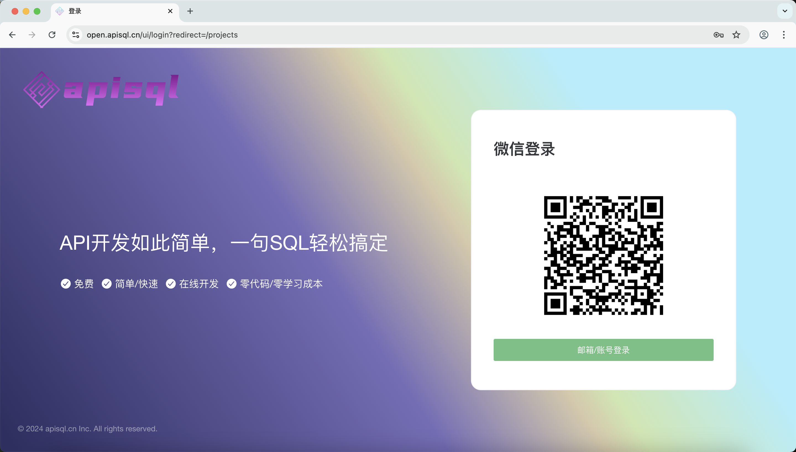
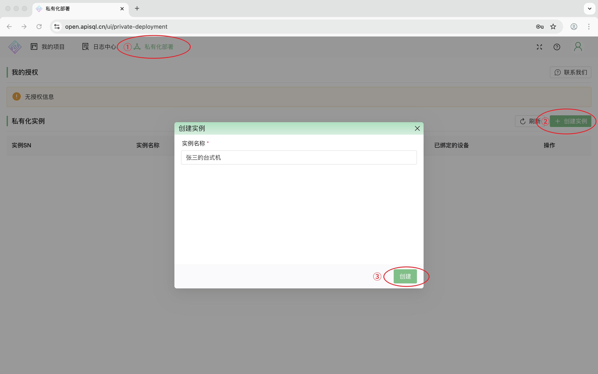
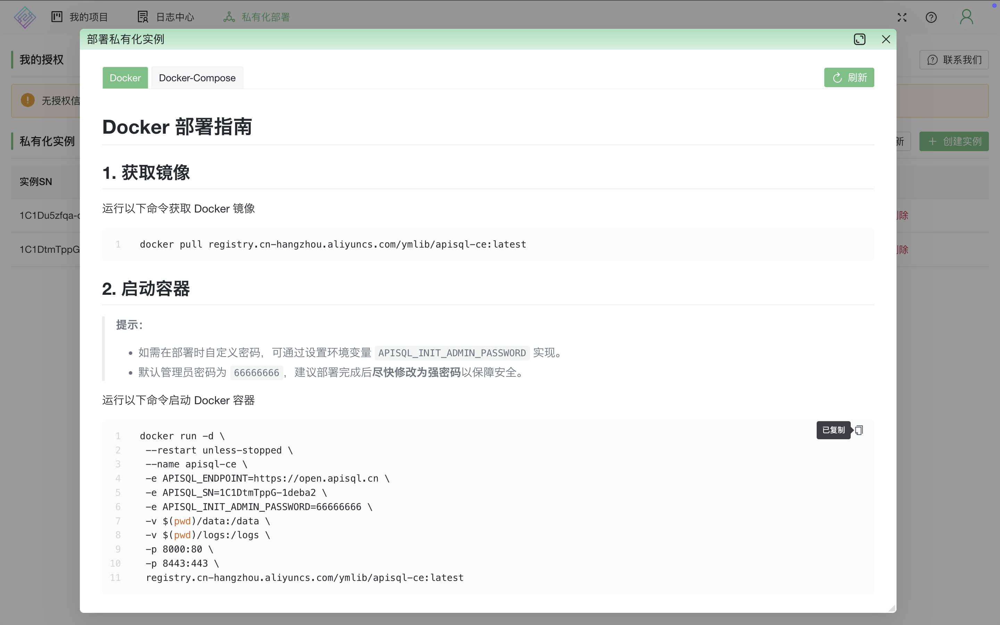
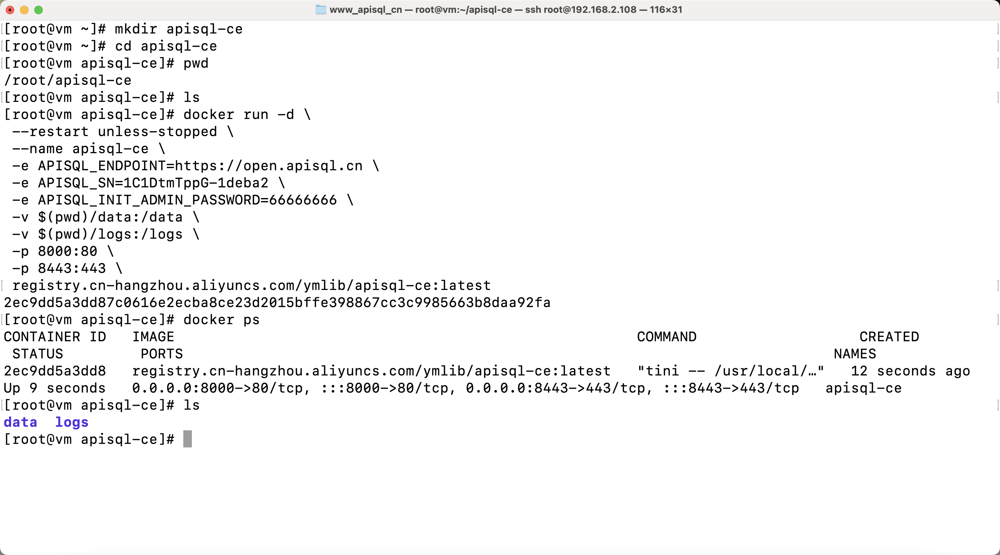
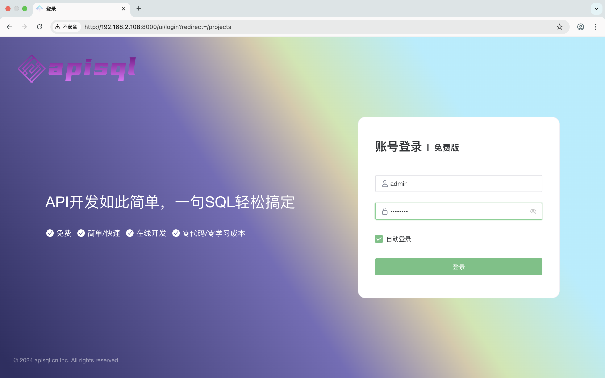
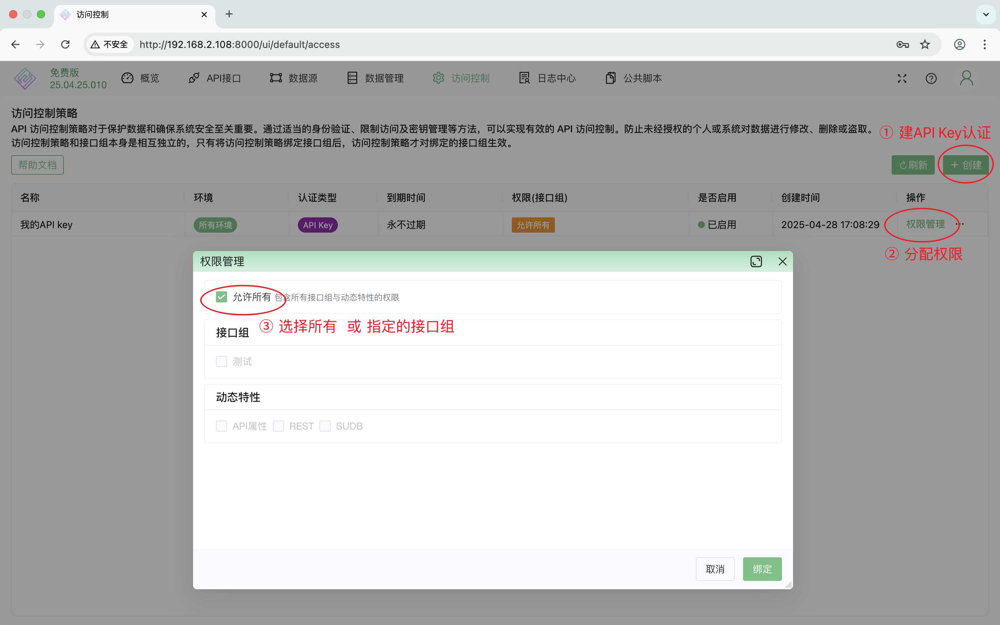
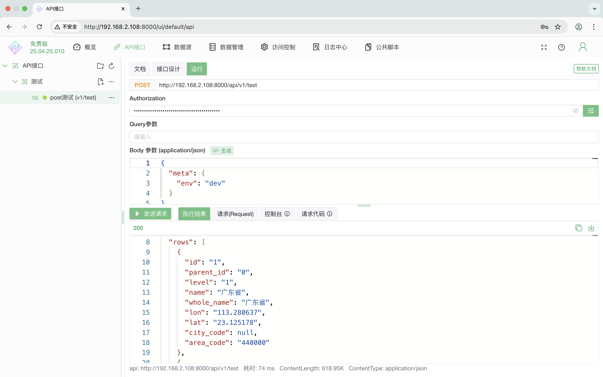

# apiSQL免费版-私有部署

> APISQL免费版现已正式上线！这是我们向更广泛开发者群体迈出的重要一步，也是我们对用户的坚定承诺。让我们携手共进，开启API开发的新篇章！

## 免费版功能
APISQL免费版专为个人开发者和小型项目量身打造，提供了丰富且实用的基础功能：
- 支持主流数据库的表、视图、自定义函数、存储过程发布为API
- 支持SELECT、INSERT INTO、DELETE、UPDATE发布为API
- 支持GET、POST、PUT、DELETE方法
- 支持API key、绑定IP、JWT（JSON Web Token）等安全认证
- 支持自定义传参、支持分页、支持排序、导出Excel等实用功能
- 支持MySQL、Oracle、SQLServer、PostgreSQL、SQLite、达梦等OLTP数据库
- 支持Apache Doris、SelectDB、StarRocks、TiDB、华为DWS(GaussDB)等OLAP数据库

## 私有部署
### 1. 微信登录

 访问网址 [https://open.apisql.cn](https://open.apisql.cn) 推荐微信扫一扫快速登录，以后再也不会忘记用户名密码了。

 
 
 
### 2. 创建实例
登录平台后，选择私有化部署，创建实例；

 
 

### 3. Docker部署
复制docker run命令快速开始。
也支持使用Docker Compose，将APISQL作为API开发平台与你的数据库、前端项目编排在一起使用。

如需在部署时自定义密码，请直接修改命令（默认值：66666666）即可。
 
 

### 4. docker run启动容器
推荐单独新建一个文件夹再运行，其中data和logs就是自己的数据和日志，方便备份等操作。

 
 

### 5. 登录

用户名admin，默认密码：66666666，建议部署完成后尽快修改为强密码。

登录后配置【访问控制】，常用API key、IP鉴权、JWT(JSON Web Token）授权

最后设计API、运行API，无需安装其他软件！

