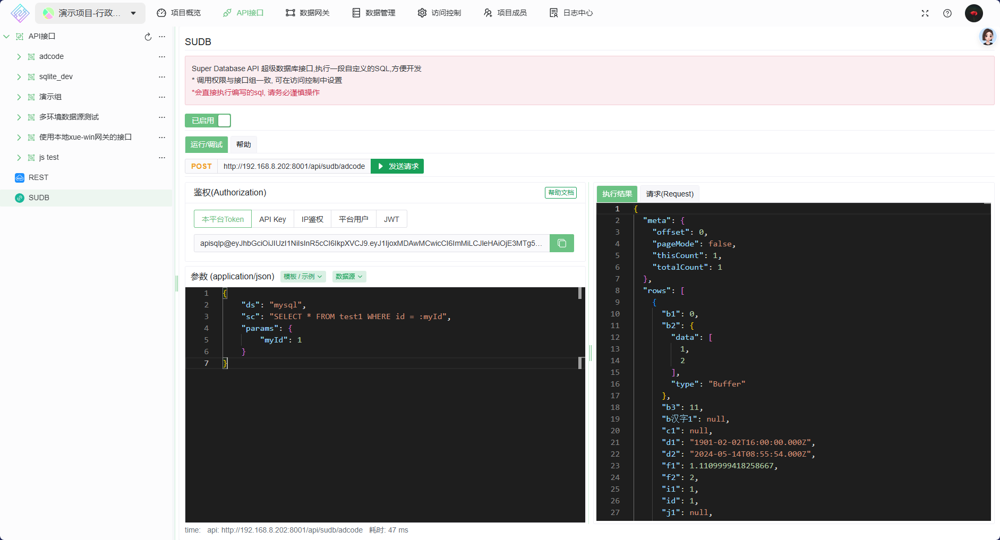
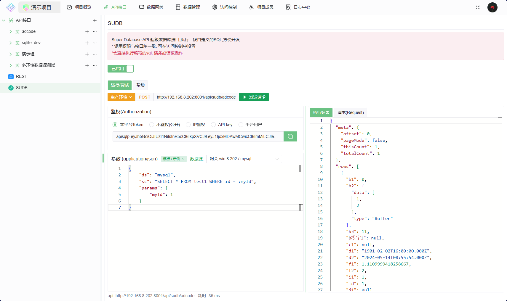
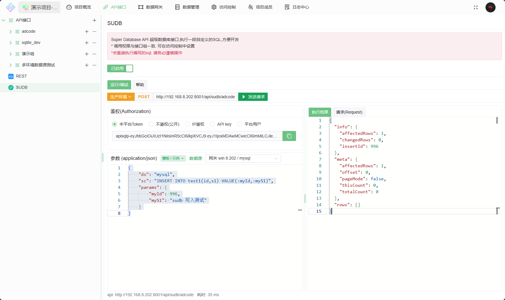
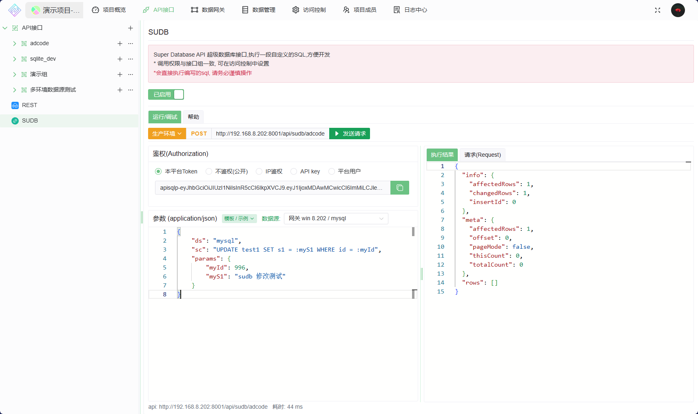
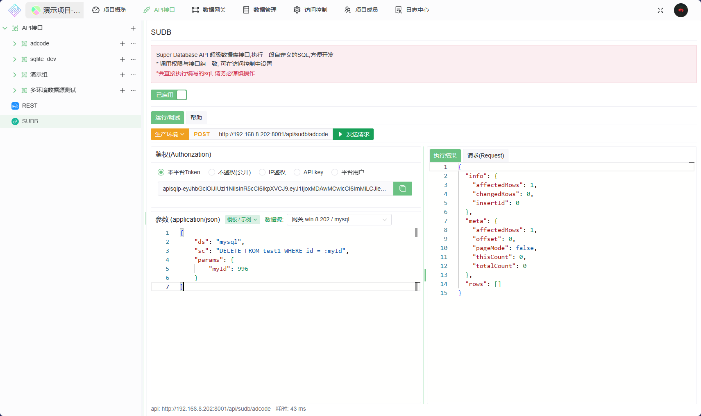
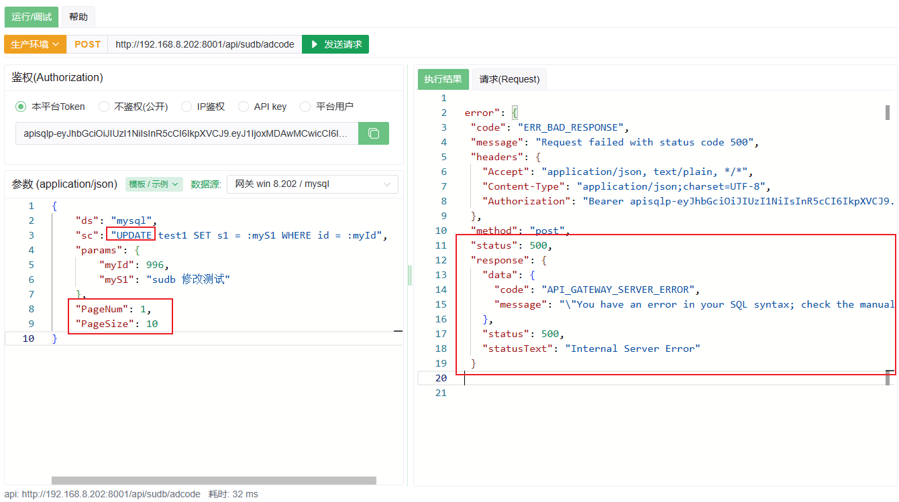
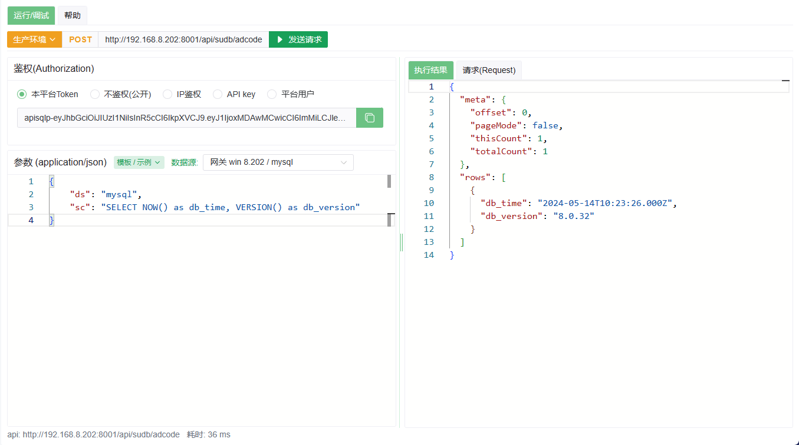

# SUDB

Super Database API 超级数据库接口, 通过Api执行自定义的SQL

* 适用于开发人员
* 对于简单的 增删改查接口, 可直接通过 API 中携带sql来完成,免去服务端写无意义的接口
* 更加专注业务,节约大量成本,提高工作效率

## 局限性

1. 因为是直接执行SQL,所以安全性需考虑

## 开始

### 1. 安装网关并添加一个数据源

### 2. 启用SUDB功能

与`REST`模块相似,请参考 [REST](./0030@REST.md)

### 3. 使用



#### 参数说明

```js
const 属性说明 = {
    "ds":"",    // string, 数据源名称: 表示此次执行的目标数据源
    "dsEnv": null, // string|null, 数据源环境名称: 数据源启用了多环境时需指明,否则无意义
    "sc":"",    // string, sql content, 自己编写的SQL脚本
    "params":{  // Object, 参数信息
        "id":1,
        "name":2
    },
    // 分页信息 pageSize,pageNum , 若 SQL 是非 `SELECT` 操作 ,请勿使用此参数, 否则结果可能与预期不否
    "pageSize": 30,  // 分页 每页大小 
    "pageNum": 1,    // 分页 当前页码 
}
```

#### 示例

* 数据源未启用多环境,参数 `env` 无意义, 省略即可

1. 查询

   ```js
   // 查询数据源 'mysql' 下表 'test1' 中 id =1 的数据
   const body={
        "ds": "mysql",
        "sc": "SELECT * FROM test1 WHERE id = :myId",
        "params": {
            "myId": 1
        }
   }
   ```

    
2. 分页查询

   ```js
   // 分页查询 数据源 'mysql' 下表 'test1'  的数据
   const body={
        "ds": "mysql",
        "sc": "SELECT * FROM test1 ",
        "PageNum": 1,
        "PageSize": 10
   }
   ```

    

3. 添加一条数据

   ```js
   // 添加一条数据到 数据源 'mysql' 下表 'test1'  中
   const body={
        "ds": "mysql",
        "sc": "INSERT INTO test1(id,s1) VALUE(:myId,:myS1)",
        "params": {
            "myId": 996,
            "myS1": "sudb 写入测试"
        }
   }
   ```

   
4. 修改一条数据

   ```js
   // 修改 数据源 'mysql' 下表 'test1'  中 id =996 的数据
   const body={
        "ds": "mysql",
        "sc": "UPDATE test1 SET s1 = :myS1 WHERE id = :myId",
        "params": {
            "myId": 996,
            "myS1": "sudb 修改测试"
        }
    }
   ```

   
5. 删除一条数据

   ```js
   // 删除 数据源 'mysql' 下表 'test1'  中 id =996 的数据
   const body={
        "ds": "mysql",
        "sc": "DELETE FROM test1 WHERE id = :myId",
        "params": {
            "myId": 996
        }
    }
   ```

   

6. 错误示例- 分页信息带来的错误

    ```js
    // 这是一个 update 语句 ,但是传入了分页信息, 会出错的
    const body={
        "ds": "mysql",
        "sc": "UPDATE test1 SET s1 = :myS1 WHERE id = :myId",
        "params": {
            "myId": 996,
            "myS1": "sudb 修改测试"
        },
        "PageNum": 1,
        "PageSize": 10
    }
    ```

   
7. 更多玩法

   ```js
   // 属性 `sc` 就是sql ,网关会直接执行,此处随意编写
   // 1. 获取数据库时间和版本
   const body={
       "ds": "mysql",
       "sc": "SELECT NOW() as db_time, VERSION() as db_version"
   } 

   // 2. 获取数据库 表信息时间
   const body={
       "ds": "mysql",
       "sc": "SELECT table_name FROM  information_schema.tables"
   } 
   ```

   
