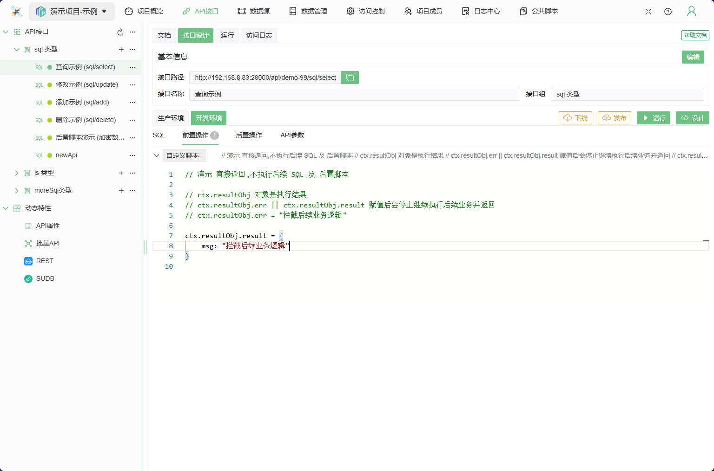
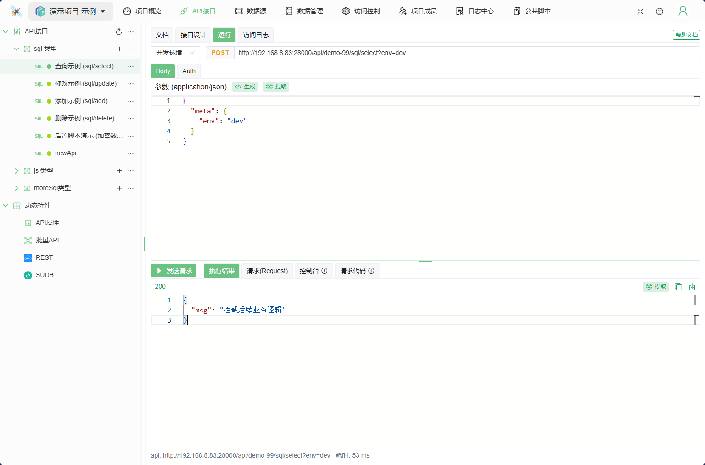
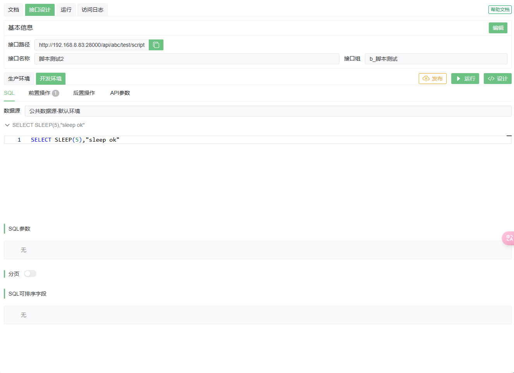
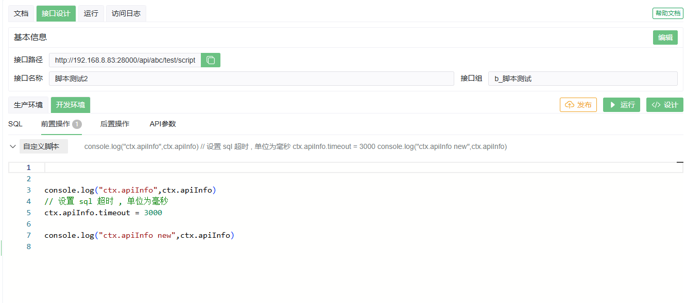
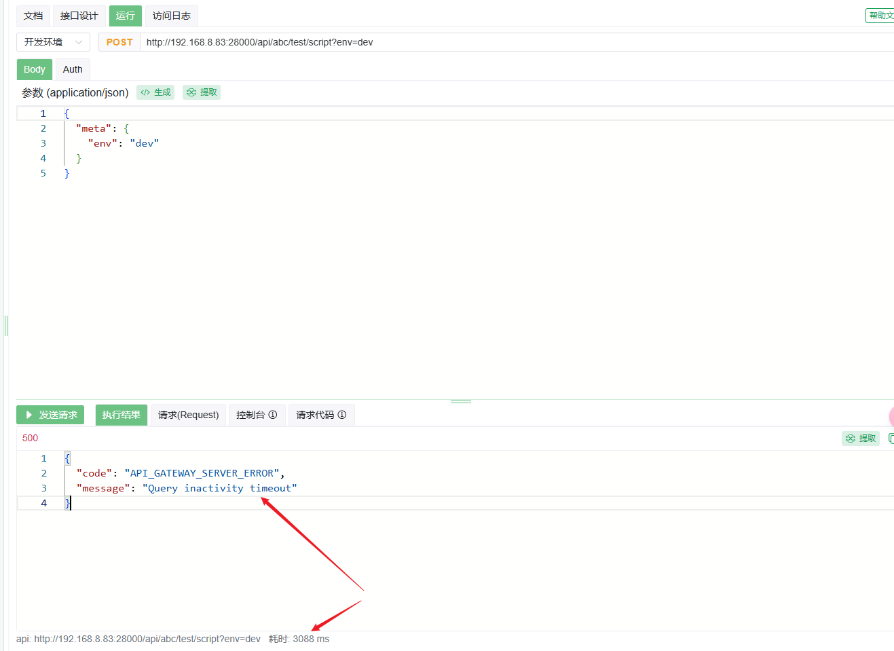

# 前置脚本

前置脚本是在 SQL 语句执行之前运行的 JS 脚本

## 示例

关于 自定义错误状态码,参见JS类API中关于 [HTTP 响应状态码](../../050@语法指南/0020@JSAPI脚本指南.md#HTTP响应状态码) 的描述

### 1. 停止后续 SQL 执行, 直接返回

一般可用在参数检查, 鉴权等业务逻辑中

```js
// 演示 直接返回,不执行后续 SQL 及 后置脚本 

// ctx.resultObj 对象是执行结果
// ctx.resultObj.err || ctx.resultObj.result 赋值后会停止继续执行后续业务并返回
ctx.resultObj.err = "拦截后续业务逻辑"

```


执行结果


### 2. 设置执行SQL时的 Timeout 参数
>
> 支持 mysql/oracle 数据源
>
通过前置脚本来设置 执行sql语句时的超时时间(单位为毫秒)

这里需要区分两个超时概念: **执行SQL时的Timeout** 与 **执行api时的Timeout** :

1. 执行api时的Timeout: 是执行api全过程的超时, 其值来自api请求参数 `meta.timeout` , 若未自定义 `meta.timeout`, 则使用系统默认值(30000ms(5分钟));
2. SQL执行时的Timeout: 只负责执行SQL语句, 不含传输层等其他耗时操作

因此: **执行SQL时的Timeout** <= **执行api时的Timeout**, 否则无意义

**不建议使用此方法设置 SQL执行时的Timeout, 建议在 api 调用时直接设置 `执行api时的Timeout` 即可**

> 此演示数据源为 mysql类型

```js
// 演示 设置 SQL 执行时的 Timeout 参数

// console.log("ctx.apiInfo",ctx.apiInfo)
// 设置 sql 超时 , 单位为毫秒
ctx.apiInfo.timeout = 3000

// console.log("ctx.apiInfo new",ctx.apiInfo)


```

sql 如下,模拟 5s 后返回

```sql

SELECT SLEEP(5),"sleep ok"

```

接口设计如下:

1. sql:

1. 前置脚本:


此时发送请求, 会在 3s 后返回 timeout 错误(此错误为数据库引擎返回的)

```js
{
  "code": "API_GATEWAY_SERVER_ERROR",
  "message": "Query inactivity timeout"
}
```


