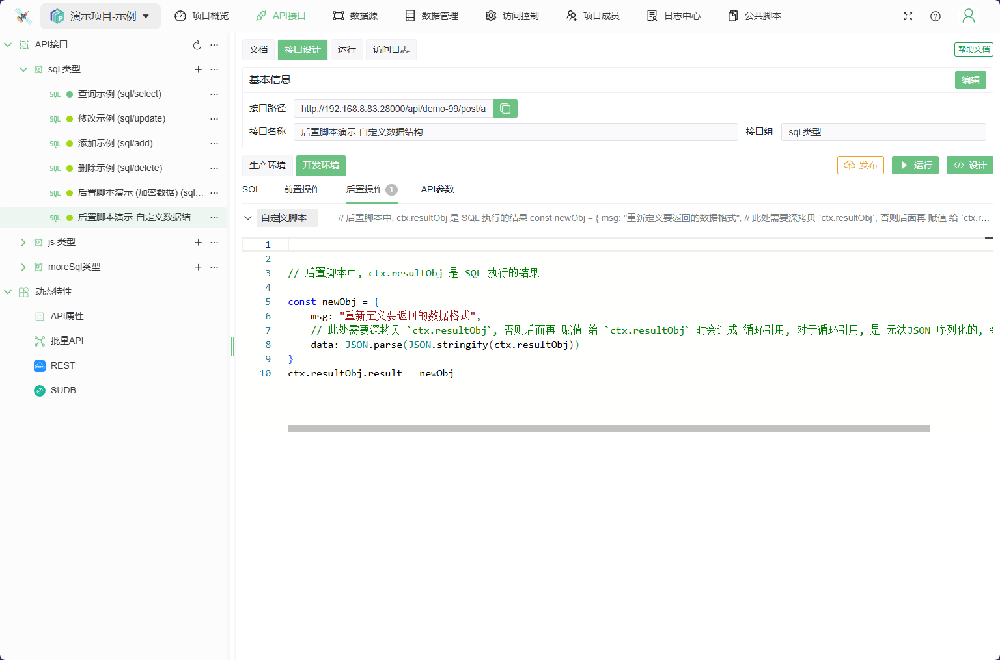
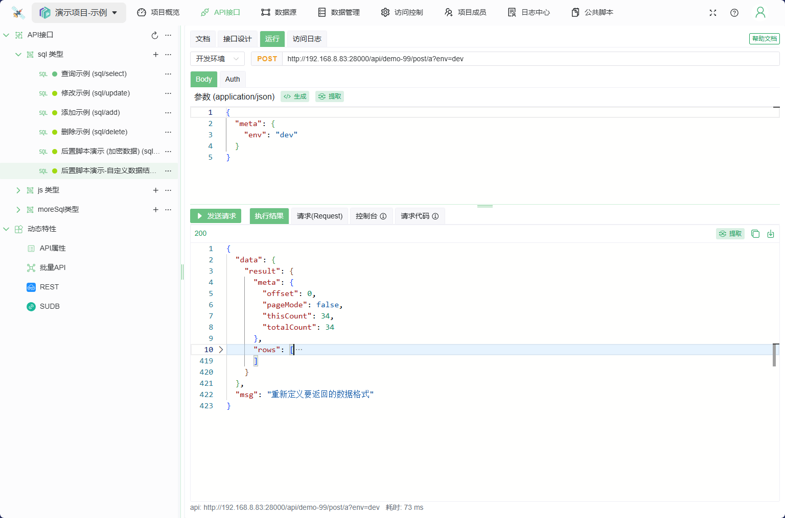
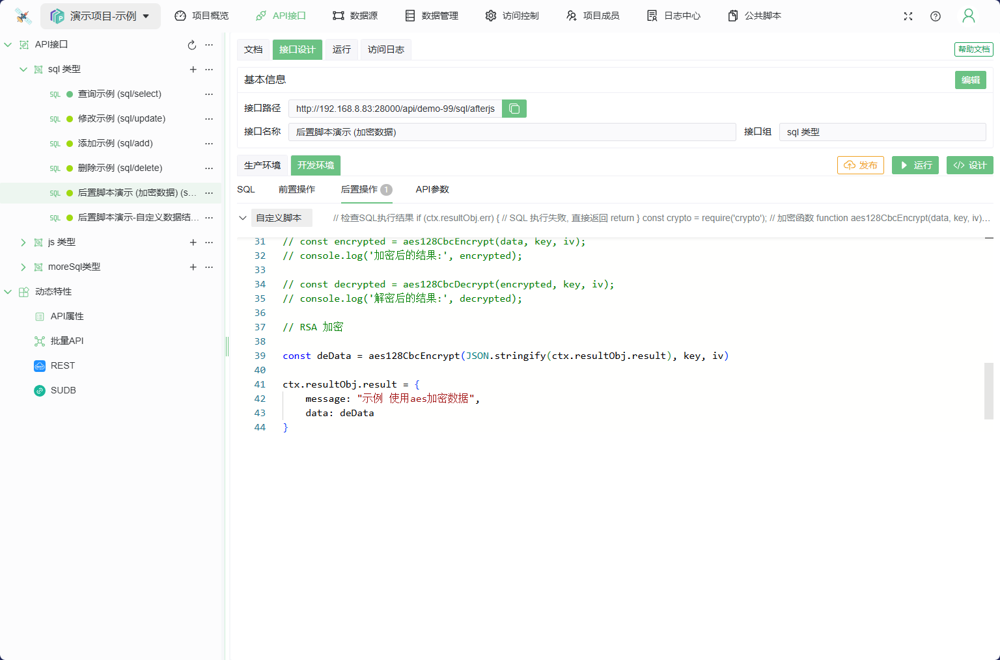
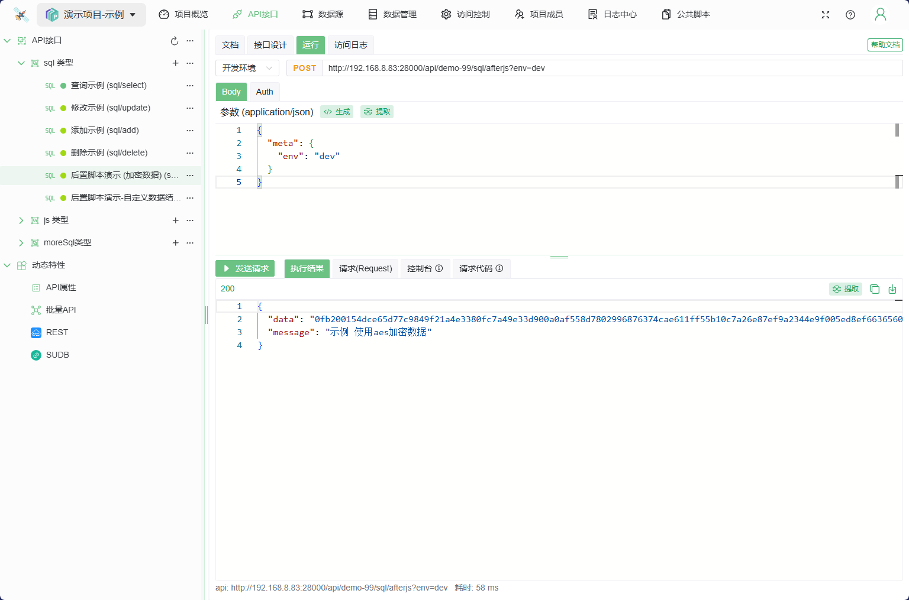

# 后置脚本

后置脚本是在 SQL 语句执行之后运行的 JS 脚本

## 示例

关于 自定义错误状态码,参见JS类API中关于 [HTTP 响应状态码](../../050@语法指南/0020@JSAPI脚本指南.md#HTTP响应状态码) 的描述

### 1. 自定义响应的数据结构

```js

// 后置脚本中, ctx.resultObj 是 SQL 执行的结果

const newObj = {
    msg: "重新定义要返回的数据格式",
    // 此处需要深拷贝 `ctx.resultObj`, 否则后面再 赋值 给 `ctx.resultObj` 时会造成 循环引用, 对于循环引用, 是 无法JSON 序列化的, 会出错
    data: JSON.parse(JSON.stringify(ctx.resultObj))
}
ctx.resultObj.result = newObj

```


返回结果


### 2. 数据加密

```js
    if (ctx.resultObj.err) {
        // SQL 执行失败, 直接返回
        return
    }

    const crypto = require('crypto');

    // 加密函数
    function aes128CbcEncrypt(data, key, iv) {
        const cipher = crypto.createCipheriv('aes-128-cbc', key, iv);
        let encrypted = cipher.update(data, 'utf8', 'hex');
        encrypted += cipher.final('hex');
        return encrypted;
    }

    // 解密函数
    function aes128CbcDecrypt(encryptedData, key, iv) {
        const decipher = crypto.createDecipheriv('aes-128-cbc', key, iv);
        let decrypted = decipher.update(encryptedData, 'hex', 'utf8');
        decrypted += decipher.final('utf8');
        return decrypted;
    }

    const key = Buffer.from('1234567890abcdef', 'utf8');  // 16 字节的密钥
    const iv = Buffer.from('0123456789abcdef', 'utf8');   // 16 字节的初始化向量

    // 示例用法
    // const data = '这是要加密的数据';

    // const encrypted = aes128CbcEncrypt(data, key, iv);
    // console.log('加密后的结果:', encrypted);

    // const decrypted = aes128CbcDecrypt(encrypted, key, iv);
    // console.log('解密后的结果:', decrypted);

    // RSA 加密

    const deData = aes128CbcEncrypt(JSON.stringify(ctx.resultObj.result), key, iv)

    ctx.resultObj.result = {
        message: "示例 使用aes加密数据",
        data: deData
    }
```


执行后返回

