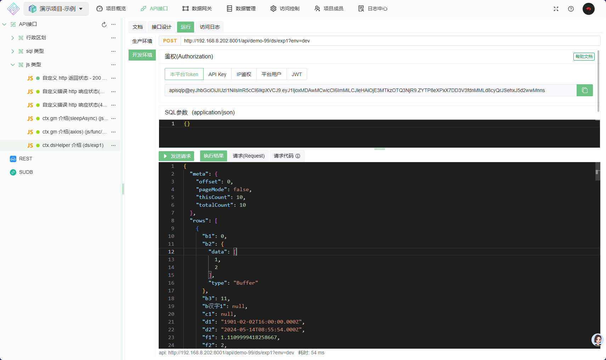

# JS API 脚本编写指南

本文将演示如何快速编写JS脚本

## 全局方法

类型定义, 为了快速开发API, 请仔细阅读下文
`ctx` 对象包含了接口运行的相关信息
`ctx.gm` 对象提供了一些常用方法及常用的JS库
`ctx.dsHelper` 对象提供了操作当前网关下数据源的接口

```ts
/**
 * Type definitions for apisql
 * js context
 * @version 3.0.1
 * @description js类api
 * @date: 2025-01-02
 */

/// <reference types="node" />

/**
 * js类api 执行自定义脚本的上下文
 * @description 全局变量 ctx ,
 *
 */
declare let ctx: JsApi.Context;

declare namespace JsApi {
    export interface Context {
        /**
         * 数据源接口
         */
        dsHelper: DataSourceHelper;

        /**
         * 接口信息
         */
        apiInfo: ApiInfo;

        /**
         * 扩展数据
         */
        options: Options;
        /**
         * 此次http请求的参数
         */
        request: RequestOpts;

        /**
         * 将要返回的数据赋值到此变量,即可返回
         * 前置脚本:此值未空,中若赋值,则立即返回此值(SQL与后置都不会执行)
         * 后置脚本:此值是SQL的执行结果,可以对数据进一步处理后再次赋值到此属性
         */
        resultObj: ResultObj;
        /**
         * gm 对象提供了一些常用方法及JS库
         */
        gm: GlobalMethods;
    }

    export type RequestOpts = {
        method: string;
        /**
         * @example {"Accept":["application/json, text/plain"],"Accept-Encoding":["gzip, deflate"]}
         *
         */
        header: Record<string, any>;
        /**
         * 编码后的 query values, 不含 '?'
         * @example 'foo=bar&#x26;abc=xyz&#x26;abc=123'
         */
        rawQuery: string;
        requestURI: string;
        /**
         *
         * 解析了 'rawQuery' ,方便使用
         * 详见 querystring.parse()
         *
         * For example, the query string 'foo=bar&#x26;abc=xyz&#x26;abc=123' is parsed into:
         * @example {foo: 'bar',abc: ['xyz', '123']}
         */
        query: Record<string, string | string[]>;
        /**
         * request body
         * 只支持 "application/json;charset=UTF-8"
         */
        body: Record<string, any>;
    };

    export type Options = {
        /**
         * 当前接口执行环境,是不是开发环境,默认 false
         */
        isDev: boolean;
        /**
         * 此次请求的 超时时间,单位毫秒
         */
        timeout: number;
    };

    /**
     * 接口信息
     */
    export type ApiInfo = {
        /**
         * @description 在 API 中编写的sql脚本
         */
        content: string;
    };

    export type ResultObj = {
        /**
         * 执行异常信息, 支持自定义Http返回错误信息
         * @example err="执行失败" ==> httpResponseStatusCode:500,httpResponseBody:{message:"执行失败"}
         * @example err={status:401,message:'认证失败'} =+> httpResponseStatusCode:401,httpResponseBody:{message:"认证失败"}
         */
        err?:
            | string
            | {
                  status: number; //default 500
                  message: string;
              };
        /**
         * 执行的结果,httpResponseBody
         *
         */
        result?: any;
    };

    export type GlobalMethods = {
        /**
         * sleep 函数
         * @example 等一秒, await sleepAsync(1000)
         * @param timeout ms
         * @returns
         */
        sleepAsync: (timeout: number) => Promise<void>;
        /**
         * https://www.npmjs.com/package/axios/v/1.7.7
         */
        axios: object;
        /**
         * 注意 此库原名称 为 'jwt-decode' ,此处将其中的 中划线 ('-') 改成了 下划线('_')
         * https://www.npmjs.com/package/jwt-decode/v/4.0.0
         */
        jwt_decode: object;
        /**
         * https://www.npmjs.com/package/json5/v/2.2.3
         */
        json5: object;
        /**
         * https://www.npmjs.com/package/mqtt/v/5.10.1
         */
        mqtt: object;
        /**
         * https://www.npmjs.com/package/mssql/v/11.0.1
         */
        mssql: object;
        /**
         * https://www.npmjs.com/package/mysql2/v/3.11.3
         */
        mysql2: object;
        /**
         * https://www.npmjs.com/package/oracledb/v/6.6.0
         */
        oracledb: object;
        /**
         * https://www.npmjs.com/package/pg/v/8.13.0
         */
        pg: object;
        /**
         * 注意 此库原名称 为 'better-sqlite3' ,此处将其中的 中划线 ('-') 改成了 下划线('_')
         * https://www.npmjs.com/package/better-sqlite3/v/11.3.0
         */
        better_sqlite3: object;
    };

    /**
     * 网关数据源
     */
    export class DataSourceHelper {
        /**
         * 此网关下的所有数据源名称
         */
        getDataSourceNames(): string[];

        /**
         *
         * @param name 数据源名称
         */
        getDataSource(name: string): DataSource;

        /**
         * 获取指定 数据源 引擎
         * 若数据源不支持多环境,则不区分环境
         * 若支持多环境,则会自动适配当前环境; 开发环境无法访问生产环境的数据源,同理,生产环境也无法访问开发环境的数据源
         *
         * @param dsNam 数据源名称
         */
        getDataSourceEngine(dsName: string, envName: string): { err?: string; eng: DataSourceEngine };
    }

    export class DataSourceEngine {
        /**
         * 执行 SQL 脚本
         * @param  sqlObj
         */
        execSqlObjs(sqlObj: SqlObj | SqlObjs): Promise<{ ok: boolean; err?: string; result?: any }>;
        /**
         * 测试 数据库连接
         */
        testConnect(): Promise<{ ok: boolean; err?: string; result?: any }>;
    }

    /**
     * 多个sqlObj ,支持事务
     */
    export type SqlObjs = {
        /**
         * @description 在 API 中设计的多个sql脚本
         */
        sqlObjs: SqlObj[];
        /**
         * 是否启用事务
         */
        tran: boolean;
    };
    /**
     * 要执行的 SQL 对象, SQL相关的都在这里
     *
     * @example { sql:"SELECT * FROM user"}
     * @example { sql:"SELECT * FROM user WHERE user_id = :userId OR user_name = :userName",params:{userId:1,userName:"张三"}}
     * @example 使用已封装的分页 : { sql:"SELECT * FROM user",page:{pageNum:1,pageSize: 10}}
     *
     * @example 使用自定义SQL, 如mysql中 { sql:"SELECT * FROM user limit :l_start, :l_len ",params:{ l_start: 0, l_len: 10} }
     */
    export type SqlObj = {
        /**
         * @description 参数使用 ':' 声明 , 如 'SELECT * FROM user where name = :userName',其中 'userName' 便是参数名
         * @example SELECT * FROM user WHERE user_id = 1
         * @example SELECT * FROM user WHERE user_id = :userId
         */
        sql: string;
        /**
         * @description sql 参数
         * @example { "userId": 1 }
         */
        params?: Record<string, any>;
        /**
         * 动态过滤
         * @example { "userId": 1 }
         */
        dynFilter?: Record<string, any>;
        /**
         * 分页
         * page 属性存在即分页,若要关闭分页, 则使用 page = null 或 page = undefined
         * @example page: { pageNum: 1, pageSize: 10, }
         * @example page: undefined
         */
        page?: {
            pageNum: number;
            pageSize: number;
        };
        /**
         * 动态排序, 在不修改sql 语句的基础上可以自定义排序
         * 如 sql ="select id,name from user" ,sortby = { "id": "desc" } ,则结果按 id 降序排列
         * @example { "id": "desc" }
         */
        sortby?: Record<string, any>;
        /**
         * @description 是否返回列信息,默认不返回,列信息包括列名,列类型等
         */
        colInfo?: number;

        /**
         * @description 不分页: 限制最大返回行数,如 limitRow = 1000,则最多返回1000行,默认不限制
         * @description 分页: 限制每页最大返回行数,如 limitRow = 1000,则每页最多返回1000行,默认不限制
         */
        limitRow?: number;
    };

    export type DataSource = {
        name: string;
        enableMultipleEnvs: boolean;
        envs: DataSourceEnv[];
    };
}

```

## 示例

更多示例 可以在 apiSQL [演示项目](https://open.apisql.cn/ui/demo-area/overview) 中查看

### HTTP响应状态码

如何自定义 [HTTP 响应状态码](https://developer.mozilla.org/zh-CN/docs/Web/HTTP/Status)

执行失败,默认状态码为 `500`
执行成功,默认状态码为 `200`

1. 默认错误, 接口设计如下:

    ```js
    // 默认错误, http 响应状态码 为 `500`
    ctx.resultObj.err="演示-自定义错误"

    ```

   
    接口返回

    ```json
    {
        "error": {
            "code": "ERR_BAD_RESPONSE",
            "message": "Request failed with status code 500",
            "headers": {
                "Accept": "application/json, text/plain, */*",
                "Content-Type": "application/json;charset=UTF-8",
            },
            "method": "post",
            "status": 500,
            "response": {
                "data": {
                    "code": "API_GATEWAY_SERVER_ERROR",
                    "message": "演示-自定义错误"
                }
            }
        }
    }
    ```

   
2. 自定义异常的 http 响应状态码, 如 401,接口设计如下:

    ```js
    // 自定义 
    ctx.resultObj.err = {
        status: 401,
        message: '演示-自定义错误-401'
    }
    ```

    

    接口返回

    ```json
    {
        "error": {
            "code": "ERR_BAD_REQUEST",
            "message": "Request failed with status code 401",
            "headers": {
               "Accept": "application/json, text/plain, */*",
               "Content-Type": "application/json;charset=UTF-8",
             },
            "method": "post",
            "status": 401,
            "response": {
                "data": {
                    "message": "演示-自定义错误-401"
                }
            }
        }
    }
    ```

    

3. 执行成功 此示例中 将 http 请求参数 也一起返回了,
   
   

### 使用数据源

`ctx.dsHelper` 的使用

1. 如何获得网关下的数据源引擎
    * 此示例运行的数据网关下有两个数据源,分别如下
      * `mysql_1`: 未启用多环境
      * `mysql_多环境`: 启用了多环境
    由于网关下有两个数据源, 当不指定数据源名称时获取数据源引擎会失败(无法确定用哪个数据源), 先测试下异常情况
    编写以下脚本:

   ```js
    // 获取数据源名称列表
    const dsNames = ctx.dsHelper.getDataSourceNames()
    console.log("dsNames", dsNames)

    const dsName=null 
    const resultEng = ctx.dsHelper.getDataSourceEngine(dsName)

    if (resultEng.err) {
        // 获取数据源引擎失败
        ctx.resultObj.err = resultEng.err
        // 必须 使用 `return` 结束函数运行,否则 会继续执行下面的代码 
        return
    }

    // 测试数据库连接 
    const resultTest = await resultEng.eng.testConnect()

    if (resultTest.err) {
        console.error("数据库连接失败, err:", resultTest.err)
        ctx.resultObj.err = resultTest.err
        return
    }

    //执行 SQL
    const sqlObj = {
        sql: "select * from test1 where id <= :myMaxId",
        params: {
            myMaxId: 10
        }
    }
    const resultExec = await resultEng.eng.execSqlObjs(sqlObj)

    if (resultExec.err) {
        console.error("SQL 执行失败, err:", resultExec.err)
        ctx.resultObj.err = resultExec.err
        return
    }

    ctx.resultObj.result = resultExec.result

   ```

    执行上面的代码, 返回如下  得到错误:`有多个数据源`
    

    继续修改上面的代码, 指明要执行的数据源名称 为 `mysql_1` ,因为未启用多环境,所以 数据源环境名称 不需要指定

    ```js
      // 指定数据源名称
      const dsName="mysql_1" 
      const resultEng = ctx.dsHelper.getDataSourceEngine(dsName)

      if (resultEng.err) {
          // 获取数据源引擎失败
          ctx.resultObj.err = resultEng.err
          // 必须 使用 `return` 结束函数运行,否则 会继续执行下面的代码 
          return
      }

      // 测试数据库连接 
      const resultTest = await resultEng.eng.testConnect()

      if (resultTest.err) {
          console.error("数据库连接失败, err:", resultTest.err)
          ctx.resultObj.err = resultTest.err
          return
      }

      //执行 SQL
      const sqlObj = {
          sql: "select * from test1 where id <= :myMaxId",
          params: {
              myMaxId: 10
          }
      }
      const resultExec = await resultEng.eng.execSqlObjs(sqlObj)

      if (resultExec.err) {
          console.error("SQL 执行失败, err:", resultExec.err)
          ctx.resultObj.err = resultExec.err
          return
      }

      ctx.resultObj.result = resultExec.result


    ```

    再次执行上面的代码, 返回如下: 执行成功,得到数据  
   

    继续修改上面的代码, 使用数据源 `mysql_多环境`,

    ```js
      // 指定数据源名称
      const dsName="mysql_多环境" 
      const resultEng = ctx.dsHelper.getDataSourceEngine(dsName)

      if (resultEng.err) {
          // 获取数据源引擎失败
          ctx.resultObj.err = resultEng.err
          // 必须 使用 `return` 结束函数运行,否则 会继续执行下面的代码 
          return
      }

      // 测试数据库连接 
      const resultTest = await resultEng.eng.testConnect()

      if (resultTest.err) {
          console.error("数据库连接失败, err:", resultTest.err)
          ctx.resultObj.err = resultTest.err
          return
      }

      //执行 SQL
      const sqlObj = {
          sql: "select * from test1 where id <= :myMaxId",
          params: {
              myMaxId: 10
          }
      }
      const resultExec = await resultEng.eng.execSqlObjs(sqlObj)

      if (resultExec.err) {
          console.error("SQL 执行失败, err:", resultExec.err)
          ctx.resultObj.err = resultExec.err
          return
      }

      ctx.resultObj.result = resultExec.result

    ```

    **编辑完成后重新发布,让此代码同步到生产环境** ,然后分别测试生产环境与开发环境
    开发环境执行结果
   
    生产环境执行结果
   

### 使用 gm 对象

`ctx.gm` 对象提供了一些常用方法及常用的JS库

对于 JS 库的更多用法,请参考其官方文档

1. sleep 函数, 让线程等待一会儿继续执行

    ```js
    const ct = new Date()
    // sleep 3s
    // 务必用 await 调用
    await ctx.gm.sleepAsync(3000)

    const end = new Date()

    ctx.resultObj.result = {
        "开始时间": ct.toJSON(),
        "结束时间": ct.toJSON(),
        "message": `线程睡眠了 ${end.getTime() - ct.getTime()} 毫秒(ms)`
    }
    ```

   
    接口返回
    

2. axios

    ```js

    // axios 示例
    // 调用第三方接口, 获取 当前设备 IP
    
    // 随机获取一句诗词 
    const api = 'https://api.vvhan.com/api/ian/shici?type=json'

    const resp = await ctx.gm.axios({
        url: api,
        method: "get",
        data: {},
        header: {
            'Content-Type': 'application/json'
        }
    })
    // 注意,请勿将 resp 直接返回, 此对象无法序列化 ; apiCtx.result = resp ;// 这么写会执行失败,

    // 将要返回的数据赋值给 `apiCtx.result`  
    ctx.resultObj.result = {
        messgae: '演示-使用axios',
        data: {
            status: resp.status,
            statusText: resp.statusText,
            data: resp.data,
        }
    }
    ```

   
   接口返回
   
