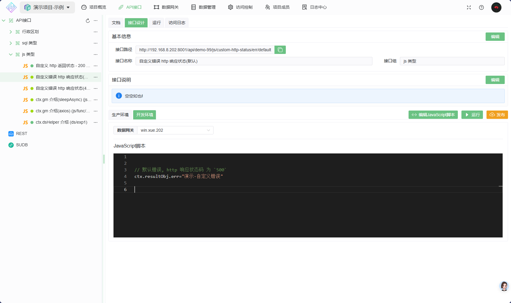
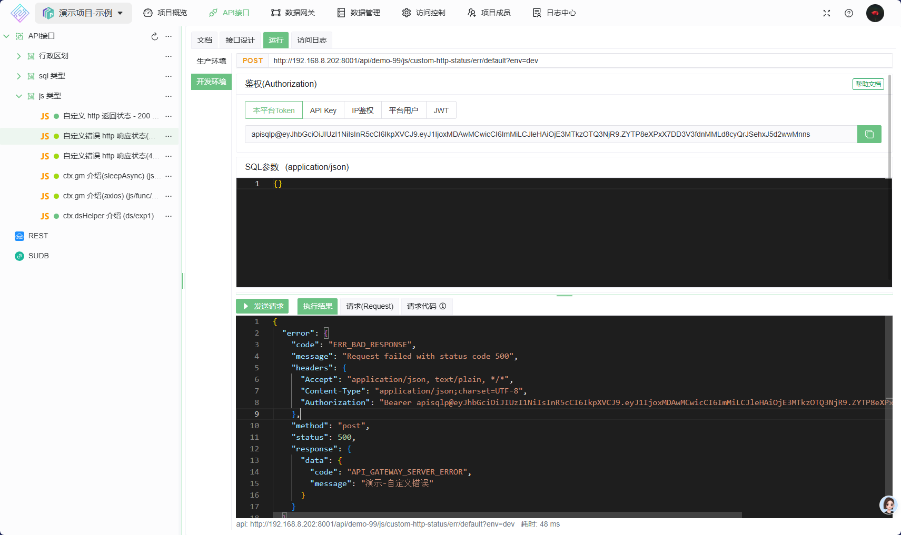
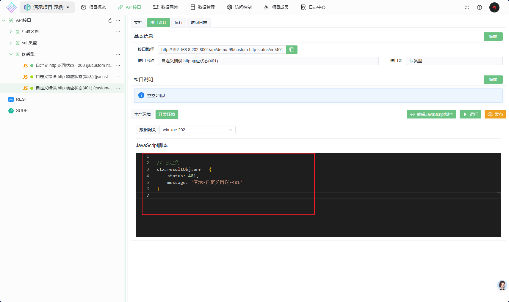
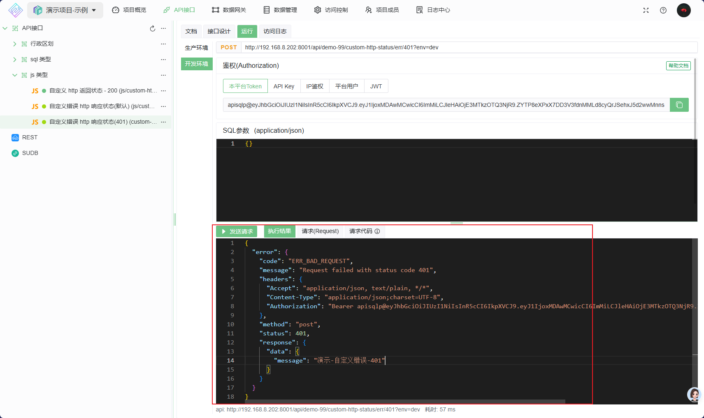
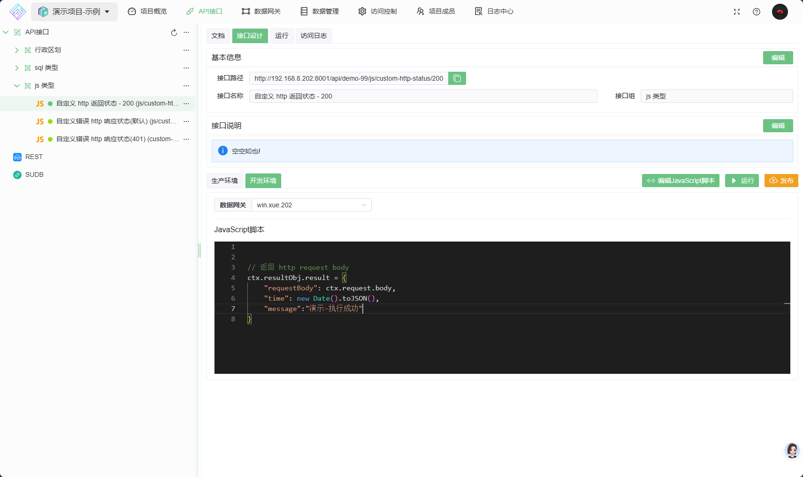
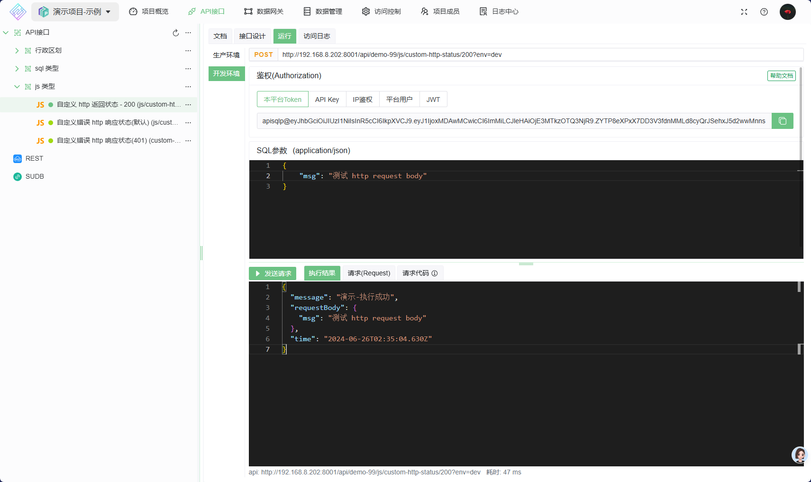

HTTP响应状态码 例子

如何自定义 [HTTP 响应状态码](https://developer.mozilla.org/zh-CN/docs/Web/HTTP/Status)

执行失败,默认状态码为 `500`
执行成功,默认状态码为 `200`

## 1. 默认错误
    接口设计如下:

    ```js
    // 默认错误, http 响应状态码 为 `500`
    ctx.resultObj.err="演示-自定义错误"

    ```

   
    接口返回

    ```json
    {
        "error": {
            "code": "ERR_BAD_RESPONSE",
            "message": "Request failed with status code 500",
            "headers": {
                "Accept": "application/json, text/plain, */*",
                "Content-Type": "application/json;charset=UTF-8",
            },
            "method": "post",
            "status": 500,
            "response": {
                "data": {
                    "code": "API_GATEWAY_SERVER_ERROR",
                    "message": "演示-自定义错误"
                }
            }
        }
    }
    ```

   
## 2. 自定义异常的 http 响应状态码
     自定义异常的 http 响应状态码如 401,接口设计如下:

    ```js
    // 自定义 
    ctx.resultObj.err = {
        status: 401,
        message: '演示-自定义错误-401'
    }
    ```

    

    接口返回

    ```json
    {
        "error": {
            "code": "ERR_BAD_REQUEST",
            "message": "Request failed with status code 401",
            "headers": {
               "Accept": "application/json, text/plain, */*",
               "Content-Type": "application/json;charset=UTF-8",
             },
            "method": "post",
            "status": 401,
            "response": {
                "data": {
                    "message": "演示-自定义错误-401"
                }
            }
        }
    }
    ```

    

## 3. 执行成功 
此示例中 将 http 请求参数 也一起返回了,
   
   
