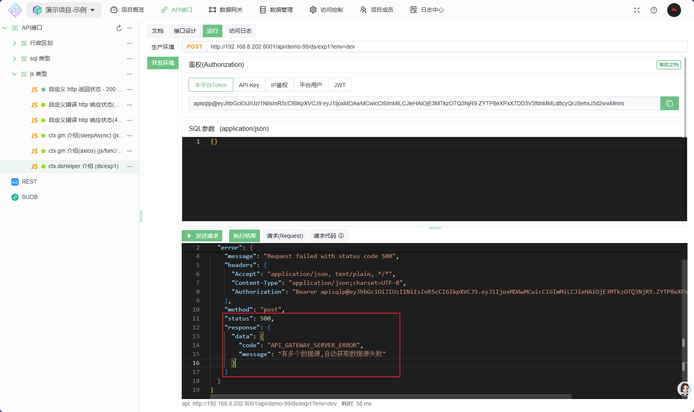
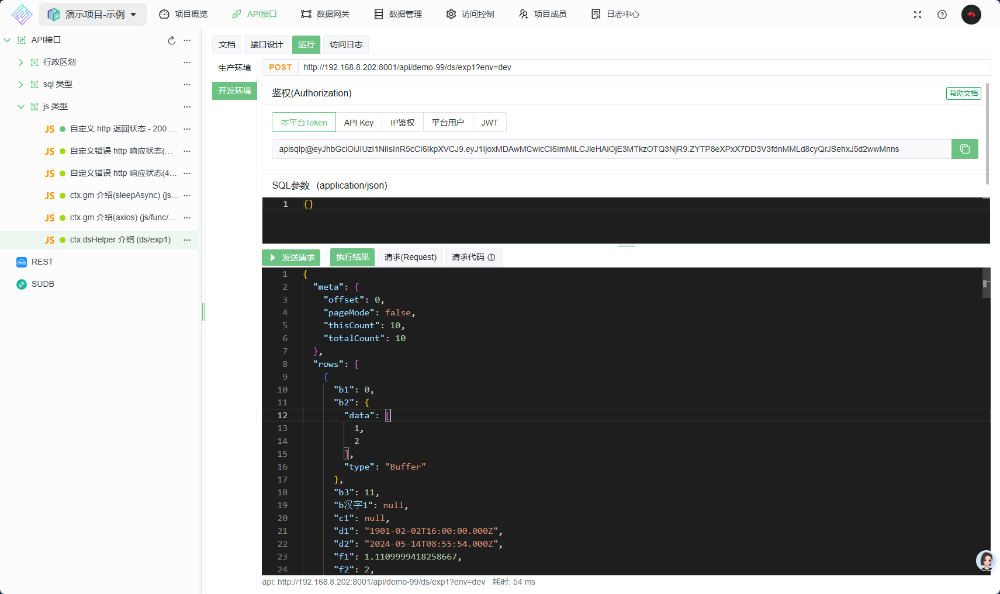
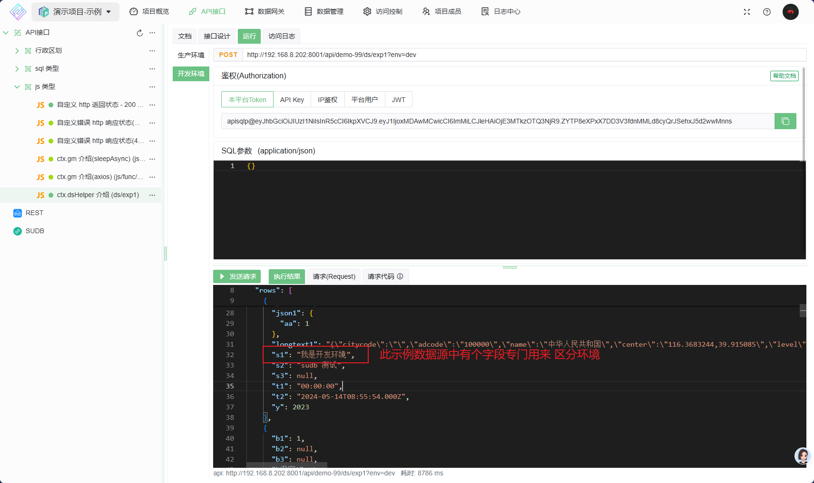
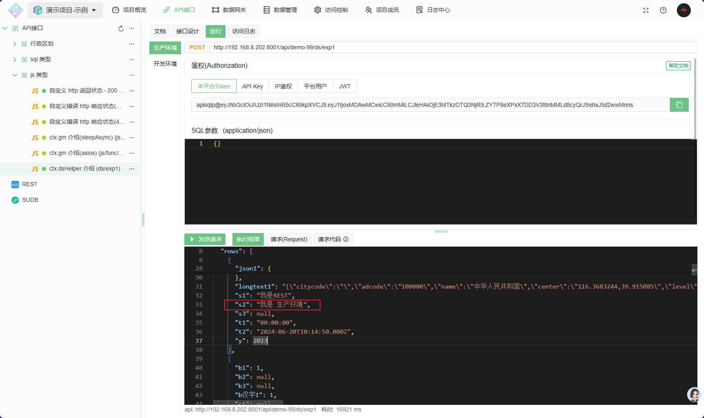

# 使用数据源

`ctx.dsHelper` 的使用

## 1. 如何获得网关下的数据源引擎
    * 此示例运行的数据网关下有两个数据源,分别如下
      * `mysql_1`: 未启用多环境
      * `mysql_多环境`: 启用了多环境
    由于网关下有两个数据源, 当不指定数据源名称时获取数据源引擎会失败(无法确定用哪个数据源), 先测试下异常情况
    编写以下脚本:

   ```js
    // 获取数据源名称列表
    const dsNames = ctx.dsHelper.getDataSourceNames()
    console.log("dsNames", dsNames)

    const dsName=null 
    const resultEng = ctx.dsHelper.getDataSourceEngine(dsName)

    if (resultEng.err) {
        // 获取数据源引擎失败
        ctx.resultObj.err = resultEng.err
        // 必须 使用 `return` 结束函数运行,否则 会继续执行下面的代码 
        return
    }

    // 测试数据库连接 
    const resultTest = await resultEng.eng.testConnect()

    if (resultTest.err) {
        console.error("数据库连接失败, err:", resultTest.err)
        ctx.resultObj.err = resultTest.err
        return
    }

    //执行 SQL
    const sqlObj = {
        sql: "select * from test1 where id <= :myMaxId",
        params: {
            myMaxId: 10
        }
    }
    const resultExec = await resultEng.eng.execSqlObjs(sqlObj)

    if (resultExec.err) {
        console.error("SQL 执行失败, err:", resultExec.err)
        ctx.resultObj.err = resultExec.err
        return
    }

    ctx.resultObj.result = resultExec.result

   ```

    执行上面的代码, 返回如下  得到错误:`有多个数据源`
    

    继续修改上面的代码, 指明要执行的数据源名称 为 `mysql_1` ,因为未启用多环境,所以 数据源环境名称 不需要指定

    ```js
      // 指定数据源名称
      const dsName="mysql_1" 
      const resultEng = ctx.dsHelper.getDataSourceEngine(dsName)

      if (resultEng.err) {
          // 获取数据源引擎失败
          ctx.resultObj.err = resultEng.err
          // 必须 使用 `return` 结束函数运行,否则 会继续执行下面的代码 
          return
      }

      // 测试数据库连接 
      const resultTest = await resultEng.eng.testConnect()

      if (resultTest.err) {
          console.error("数据库连接失败, err:", resultTest.err)
          ctx.resultObj.err = resultTest.err
          return
      }

      //执行 SQL
      const sqlObj = {
          sql: "select * from test1 where id <= :myMaxId",
          params: {
              myMaxId: 10
          }
      }
      const resultExec = await resultEng.eng.execSqlObjs(sqlObj)

      if (resultExec.err) {
          console.error("SQL 执行失败, err:", resultExec.err)
          ctx.resultObj.err = resultExec.err
          return
      }

      ctx.resultObj.result = resultExec.result


    ```

    再次执行上面的代码, 返回如下: 执行成功,得到数据  
   

    继续修改上面的代码, 使用数据源 `mysql_多环境`,

    ```js
      // 指定数据源名称
      const dsName="mysql_多环境" 
      const resultEng = ctx.dsHelper.getDataSourceEngine(dsName)

      if (resultEng.err) {
          // 获取数据源引擎失败
          ctx.resultObj.err = resultEng.err
          // 必须 使用 `return` 结束函数运行,否则 会继续执行下面的代码 
          return
      }

      // 测试数据库连接 
      const resultTest = await resultEng.eng.testConnect()

      if (resultTest.err) {
          console.error("数据库连接失败, err:", resultTest.err)
          ctx.resultObj.err = resultTest.err
          return
      }

      //执行 SQL
      const sqlObj = {
          sql: "select * from test1 where id <= :myMaxId",
          params: {
              myMaxId: 10
          }
      }
      const resultExec = await resultEng.eng.execSqlObjs(sqlObj)

      if (resultExec.err) {
          console.error("SQL 执行失败, err:", resultExec.err)
          ctx.resultObj.err = resultExec.err
          return
      }

      ctx.resultObj.result = resultExec.result

    ```

    **编辑完成后重新发布,让此代码同步到生产环境** ,然后分别测试生产环境与开发环境
    开发环境执行结果
   
    生产环境执行结果
   
