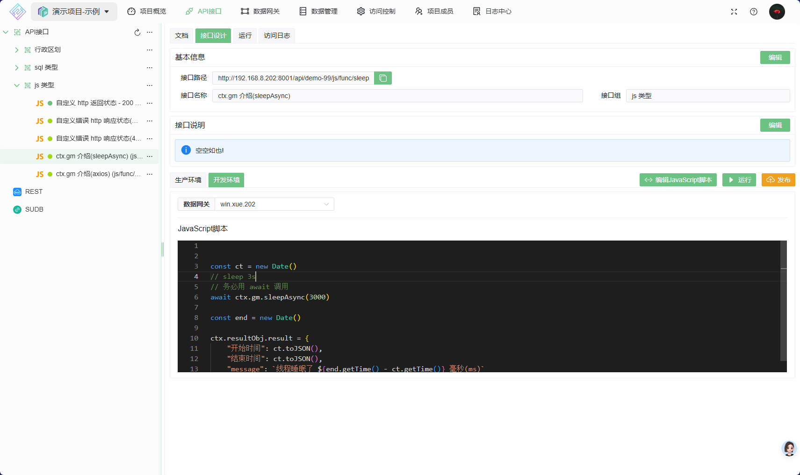
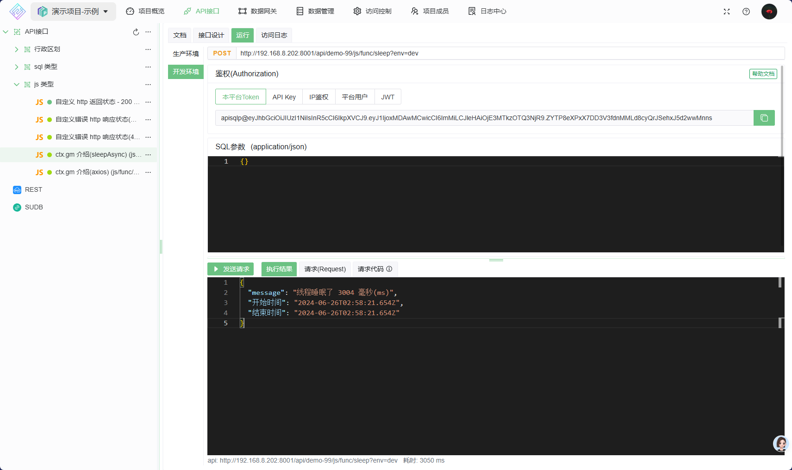
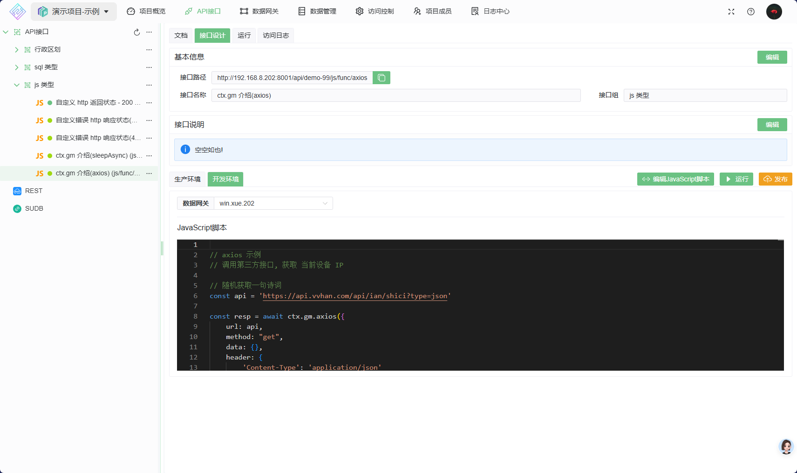
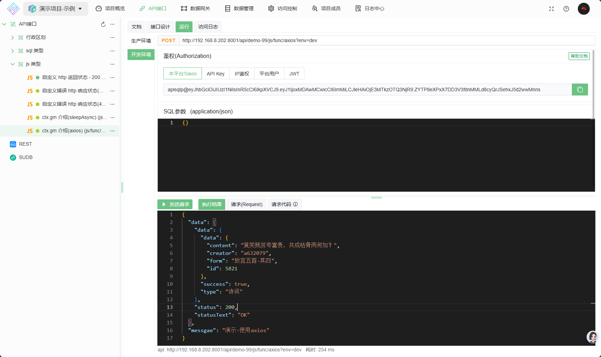

# 使用 gm 对象

`ctx.gm` 对象提供了一些常用方法及常用的JS库

对于 JS 库的更多用法,请参考其官方文档

## 1. sleep 函数, 让线程等待一会儿继续执行

    ```js
    const ct = new Date()
    // sleep 3s
    // 务必用 await 调用
    await ctx.gm.sleepAsync(3000)

    const end = new Date()

    ctx.resultObj.result = {
        "开始时间": ct.toJSON(),
        "结束时间": ct.toJSON(),
        "message": `线程睡眠了 ${end.getTime() - ct.getTime()} 毫秒(ms)`
    }
    ```

   
    接口返回
    

## 2. axios

    ```js

    // axios 示例
    // 调用第三方接口, 获取 当前设备 IP
    
    // 随机获取一句诗词 
    const api = 'https://api.vvhan.com/api/ian/shici?type=json'

    const resp = await ctx.gm.axios({
        url: api,
        method: "get",
        data: {},
        header: {
            'Content-Type': 'application/json'
        }
    })
    // 注意,请勿将 resp 直接返回, 此对象无法序列化 ; apiCtx.result = resp ;// 这么写会执行失败,

    // 将要返回的数据赋值给 `apiCtx.result`  
    ctx.resultObj.result = {
        messgae: '演示-使用axios',
        data: {
            status: resp.status,
            statusText: resp.statusText,
            data: resp.data,
        }
    }
    ```

   
   接口返回
   
