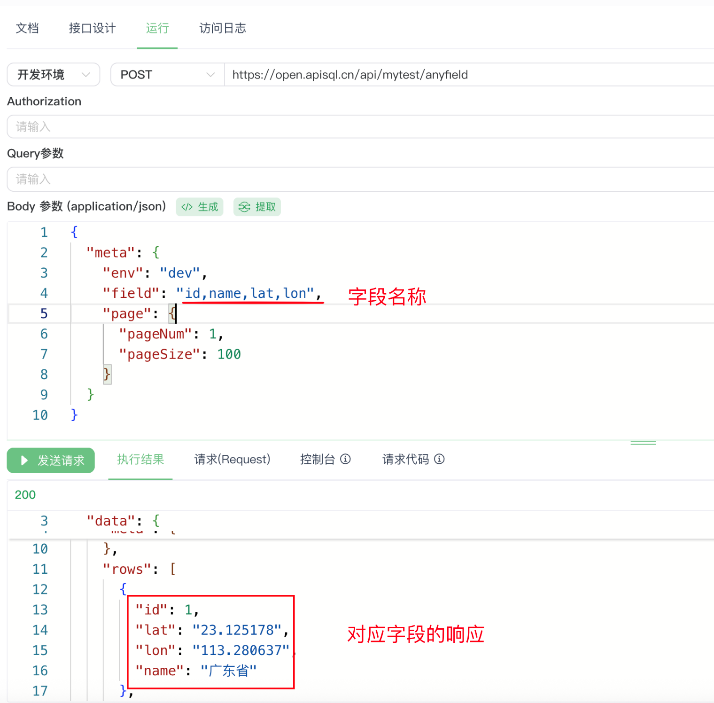

# JS中执行动态SQL
根据请求参数,动态形成SQL
废话不多说,上代码
## 源码
```js
// 配置参数
const CONFIG = {
    dataSourceName: "mysql",// 数据源名称 - 根据您的实际情况调整
    tableName: "area",// 表名
    allowedFields: ["id", "name", "area_code", "city_code", "lat", 
    "lon", "level", "parent_id", "per_pin_yin", "pin_yin", "simple_py", 
    "whole_name", "zip_code"],// 允许查询的字段白名单 - 防止SQL注入
    defaultPage: { pageNum: 1, pageSize: 10 },// 默认分页配置
    maxPageSize: 100,// 最大每页数量限制
    timeout: 30000 // 30秒 // 超时设置（毫秒）
};

console.log("=== 开始执行动态字段查询API（带分页和超时） ===");
console.log("配置信息:", JSON.stringify(CONFIG, null, 2));

try {
    // 设置超时时间
    ctx.options.timeout = CONFIG.timeout;
    console.log(`设置请求超时时间为: ${CONFIG.timeout}ms`);

    // 1. 获取请求参数中的meta字段
    const requestBody = ctx.request.body || {};
    const meta = requestBody.meta || {};
    const env = meta.env || ""; // 环境参数
    const fieldParam = meta.field || ""; // 动态字段参数
    const pageParam = meta.page || null; // 分页参数
    
    console.log("请求参数:", {
        env: env,
        field: fieldParam,
        page: pageParam,
        fullBody: requestBody
    });

    // 2. 处理分页参数
    let pageConfig = null;
    if (pageParam && typeof pageParam === 'object') {
        const pageNum = parseInt(pageParam.pageNum) || CONFIG.defaultPage.pageNum;
        let pageSize = parseInt(pageParam.pageSize) || CONFIG.defaultPage.pageSize;
        
        // 限制每页最大数量
        if (pageSize > CONFIG.maxPageSize) {
            console.warn(`pageSize ${pageSize} 超过最大限制 ${CONFIG.maxPageSize}，已自动调整`);
            pageSize = CONFIG.maxPageSize;
        }
        
        // 验证分页参数
        if (pageNum < 1 || pageSize < 1) {
            console.warn("无效的分页参数，使用默认分页配置");
            pageConfig = CONFIG.defaultPage;
        } else {
            pageConfig = { pageNum, pageSize };
        }
    } else {
        // 如果没有提供分页参数，使用默认分页
        pageConfig = CONFIG.defaultPage;
    }
    
    console.log("分页配置:", pageConfig);

    // 3. 获取所有可用的数据源名称，用于调试
    const allDataSourceNames = ctx.dsHelper.getDataSourceNames();
    console.log("当前网关下所有可用数据源:", allDataSourceNames);
    
    // 4. 验证数据源是否存在
    if (!allDataSourceNames.includes(CONFIG.dataSourceName)) {
        console.error(`配置的数据源 "${CONFIG.dataSourceName}" 不存在`);
        console.log("建议使用的数据源名称:", allDataSourceNames.join(', '));
        
        ctx.resultObj.err = {
            status: 400,
            message: `数据源 "${CONFIG.dataSourceName}" 不存在。可用数据源: ${allDataSourceNames.join(', ')}`
        };
        return;
    }

    // 5. 处理动态字段 - 安全验证
    let selectFields = "*";
    let isCustomField = false;
    
    if (fieldParam && typeof fieldParam === 'string' && fieldParam.trim()) {
        // 分割字段并去重、去空格
        const fieldArray = fieldParam.split(',')
            .map(field => field.trim().toLowerCase()) // 统一转为小写进行验证
            .filter(field => field)
            .filter((value, index, self) => self.indexOf(value) === index);
        
        console.log("原始字段列表:", fieldArray);
        
        // 验证字段是否在白名单中（不区分大小写）
        const validFields = [];
        const invalidFields = [];
        
        fieldArray.forEach(field => {
            // 在白名单中查找匹配的字段（不区分大小写）
            const matchedField = CONFIG.allowedFields.find(allowed => 
                allowed.toLowerCase() === field.toLowerCase()
            );
            
            if (matchedField) {
                validFields.push(matchedField); // 使用白名单中的原始字段名
            } else {
                invalidFields.push(field);
            }
        });
        
        console.log("有效字段:", validFields);
        console.log("无效字段:", invalidFields);
        
        if (invalidFields.length > 0) {
            console.warn(`检测到无效字段: ${invalidFields.join(', ')}`);
            // 如果没有有效字段，使用默认字段
            if (validFields.length === 0) {
                console.warn("没有有效字段，使用默认字段 *");
            }
        }
        
        if (validFields.length > 0) {
            selectFields = validFields.join(', ');
            isCustomField = true;
        }
    }
    
    // 6. 构建SQL语句
    const sql = `SELECT ${selectFields} FROM ${CONFIG.tableName}`;
    console.log("构建的SQL语句:", sql);
    console.log("是否使用自定义字段:", isCustomField);
    console.log("分页配置:", pageConfig);

    // 7. 获取数据源引擎
    console.log(`尝试获取数据源引擎: dsName="${CONFIG.dataSourceName}", envName="${env}"`);
    const resultEng = ctx.dsHelper.getDataSourceEngine(CONFIG.dataSourceName, env);
    
    if (resultEng.err) {
        console.error("获取数据源引擎失败:", resultEng.err);
        
        // 尝试不指定环境获取引擎
        console.log("尝试不指定环境获取引擎...");
        const resultEngNoEnv = ctx.dsHelper.getDataSourceEngine(CONFIG.dataSourceName, "");
        if (resultEngNoEnv.err) {
            console.error("不指定环境获取引擎也失败:", resultEngNoEnv.err);
            
            ctx.resultObj.err = {
                status: 500,
                message: `获取数据源引擎失败: ${resultEng.err || resultEngNoEnv.err}`
            };
            return;
        }
        
        resultEng.eng = resultEngNoEnv.eng;
        console.log("不指定环境获取引擎成功");
    }

    console.log("成功获取数据源引擎");

    // 8. 测试数据库连接
    console.log("测试数据库连接...");
    const resultTest = await resultEng.eng.testConnect();
    if (resultTest.err) {
        console.error("数据库连接失败:", resultTest.err);
        ctx.resultObj.err = {
            status: 503,
            message: `数据库连接失败: ${resultTest.err}`
        };
        return;
    }
    console.log("数据库连接成功");

    // 9. 执行SQL查询
    console.log(`执行SQL: ${sql}`);
    const sqlObj = {
        sql: sql,
        // 添加分页配置
        page: pageConfig,
        // 限制返回行数，防止数据量过大（分页时这个参数限制每页最大行数）
        limitRow: CONFIG.maxPageSize,
        // 不返回列信息，提高性能
        colInfo: 0
    };

    const resultExec = await resultEng.eng.execSqlObjs(sqlObj);
    if (resultExec.err) {
        console.error("SQL执行失败:", resultExec.err);
        
        // 如果是字段不存在的错误，提供更友好的错误信息
        if (resultExec.err.includes('Unknown column') || resultExec.err.includes('不存在')) {
            ctx.resultObj.err = {
                status: 400,
                message: `SQL执行失败: 字段不存在。可用字段: ${CONFIG.allowedFields.join(', ')}`
            };
        } else if (resultExec.err.includes('timeout') || resultExec.err.includes('超时')) {
            ctx.resultObj.err = {
                status: 504,
                message: `SQL执行超时（${CONFIG.timeout/1000}秒），请优化查询条件或联系管理员`
            };
        } else {
            ctx.resultObj.err = {
                status: 500,
                message: `SQL执行失败: ${resultExec.err}`
            };
        }
        return;
    }

    const resultData = resultExec.result;
    const metaInfo = resultData.meta || {};
    const rows = resultData.rows || [];
    const totalCount = metaInfo.totalCount || rows.length;
    const thisCount = metaInfo.thisCount || rows.length;
    
    console.log("SQL执行成功，返回数据行数:", {
        thisCount: thisCount,
        totalCount: totalCount,
        pageMode: metaInfo.pageMode
    });

    // 10. 构造返回结果
    ctx.resultObj.result = {
        data: resultData,
        code: 200,
        message: "查询成功"
    };

    console.log("=== API执行完成 ===");

} catch (error) {
    console.error("执行过程中发生异常:", error);
    
    // 处理不同类型的错误
    let errorMessage = error.message || error.toString();
    let statusCode = 500;
    
    if (errorMessage.includes('timeout') || errorMessage.includes('超时')) {
        statusCode = 504;
        errorMessage = `请求超时（${CONFIG.timeout/1000}秒），请稍后重试`;
    } else if (errorMessage.includes('connect') || errorMessage.includes('连接')) {
        statusCode = 503;
        errorMessage = "数据库连接失败";
    } else if (errorMessage.includes('ECONNREFUSED')) {
        statusCode = 503;
        errorMessage = "数据库连接被拒绝，请检查数据库状态";
    }
    
    ctx.resultObj.err = {
        status: statusCode,
        message: `系统异常: ${errorMessage}`
    };
}

```

## 请求参数如下
```json
{
  "meta": {
    "env": "dev",
    "field": "id,name,lat,lon",
    "page": {
      "pageNum": 1,
      "pageSize": 100
    }
  }
}
```
## 执行结果
