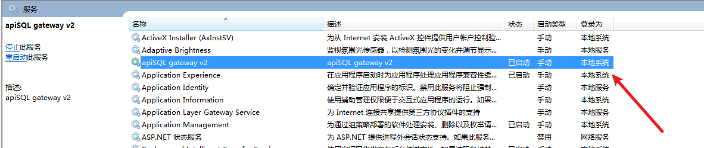
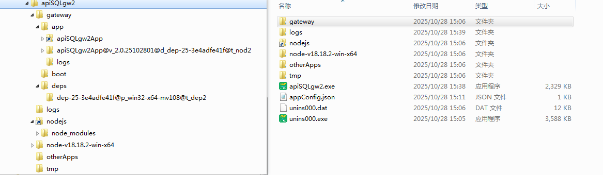

# windows的apiSQL网关2
## 安装程序
- apiSQLgw2_Setup.exe
- [备用下载地址](https://minio.hy.yyimen.com:89/store-p/apiSQL/gw/apiSQLgw2_Setup.exe)
## 配置文件 appConfig.json 介绍
```json
{
    "logLevel": "debug",
    "endpoint": "https://open.apisql.cn",
    "nodeId": "xxxxxxxx",
    "nodeToken": "xxxxx",
    "otherApps": [
        {"name": "app1","file": "testExe.exe","envs":[],"argv": ["--config","app1.json"]},
        {"name": "app2","file": "app2.js",    "envs":[],"argv": ["a","b","c 123 d"]}
    ]
}
```
- endpoint: apiSQL平台的地址,默认是 https://open.apisql.cn,若需要连接apiSQL企业版/专业版,需要修改为企业版/专业版的地址
- nodeId: apiSQL 网关的节点id,需要在平台上获取
- nodeToken: apiSQL平台的节点token,需要在平台上获取
- logLevel: 日志级别 info|debug|warn|error
- otherApps 如果用有需要,可以在这个数组中配置其他需要启动的应用
  - name: 应用的名称,在日志中会显示
  - file: 应用的可执行文件路径,可以是exe/bat/cmd/js文件
  - envs: 应用的环境变量,可以为空数组
  - argv: 应用的命令行参数,可以为空数组
## 程序是以windows的服务形式运行的

## 安装后的文件夹

## 正常的启动的资源管理器


## windows的apiSQL网关注意事项
### nodejs的版本
windows 10 及以上 node.js v22 其他 v18

### windows2008及windows7的安装注意
advapi32.dll 的版本要求是 6.1.7601 及以上
若低于可以安装KB3080149以升级
KB3080149 下载地址: https://support.microsoft.com/zh-cn/topic/更新的客户体验和诊断遥测-0b4f29c3-8361-b748-f862-7ecedbc57cbf
### 关于oracle19的oci模式
若要使用网关连接oracle19,需要安装oracle instant client(oracle称作thick模式)
oracle20及以上不需要oracle instant client(oracle称作thin模式)
#### 安装oracle instant client
- https://www.oracle.com/database/technologies/instant-client/winx64-64-downloads.html
- Version 12.2.0.1.0
  - instantclient-basic-windows.x64-12.2.0.1.0.zip
  - https://download.oracle.com/otn/nt/instantclient/122010/instantclient-basic-windows.x64-12.2.0.1.0.zip
  - The 12.2 Basic package requires the Microsoft Visual Studio 2013 Redistributable.
- Version 18.5.0.0.0 Basic Package
  - instantclient-basic-windows.x64-18.5.0.0.0dbru.zip
  - https://www.oracle.com/database/technologies/instant-client/winx64-64-downloads.html#license-lightbox
  - The 18.5 Basic package requires the Microsoft Visual Studio 2013 Redistributable
  - https://download.microsoft.com/download/b/e/8/be8a5444-cdd8-4d3d-ae09-a0979b05aee3/vcredist_x64.exe
- Version 19.28.0.0.0
  - instantclient-basic-windows.x64-19.28.0.0.0dbru.zip
  - https://download.oracle.com/otn_software/nt/instantclient/1928000/instantclient-basic-windows.x64-19.28.0.0.0dbru.zip
  - The 19.28 Basic package requires the Microsoft Visual Studio 2017 Redistributable
- Version 23.9.0.25.07
  - instantclient-basic-windows.x64-23.9.0.25.07.zip
  - https://download.oracle.com/otn_software/nt/instantclient/2390000/instantclient-basic-windows.x64-23.9.0.25.07.zip
  - The 23.9 Basic package requires the latest Microsoft Visual C++ Redistributable package common for Visual Studio 2015, 2017, 2019, and 2022.
