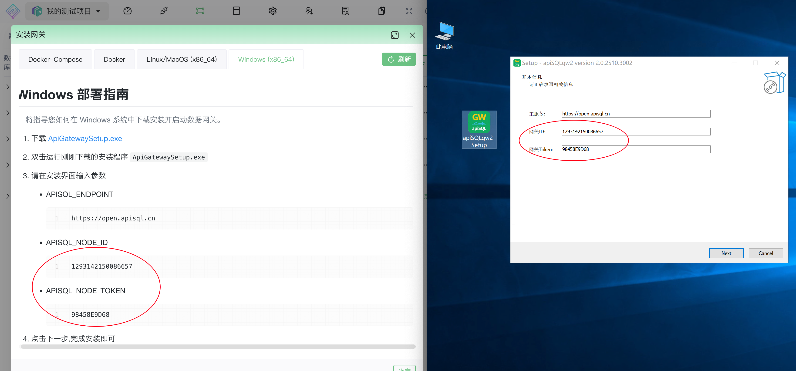
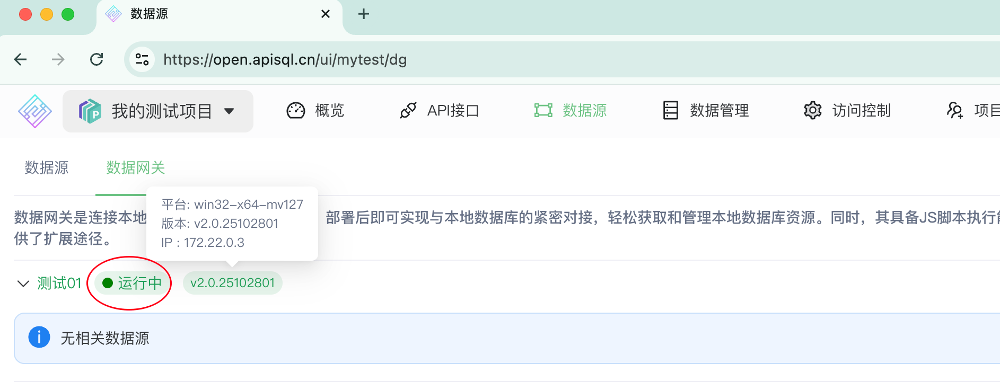
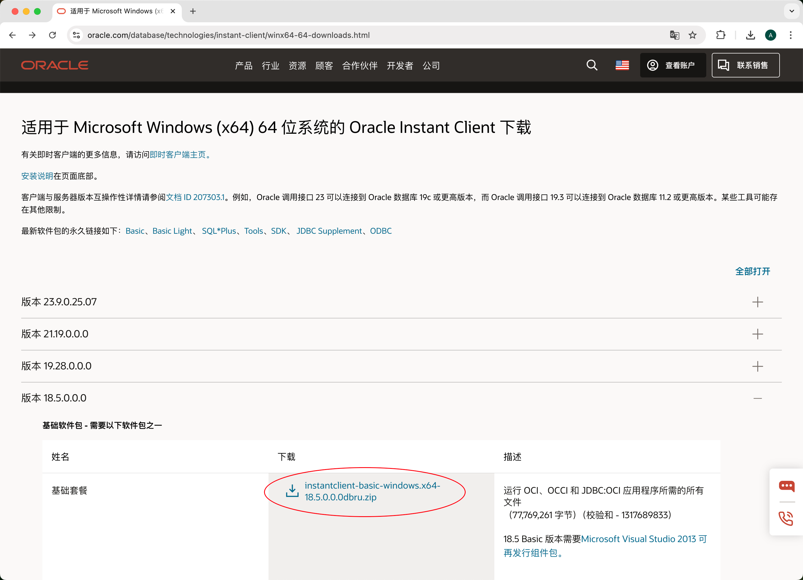
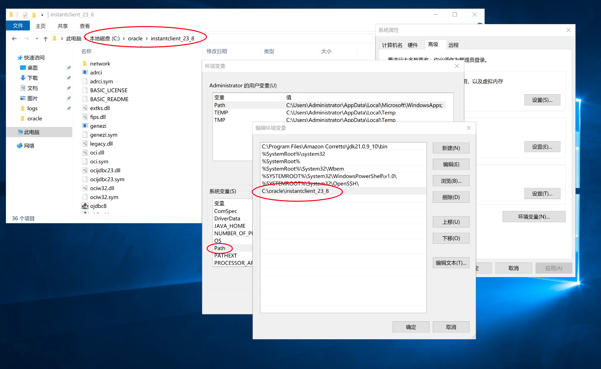
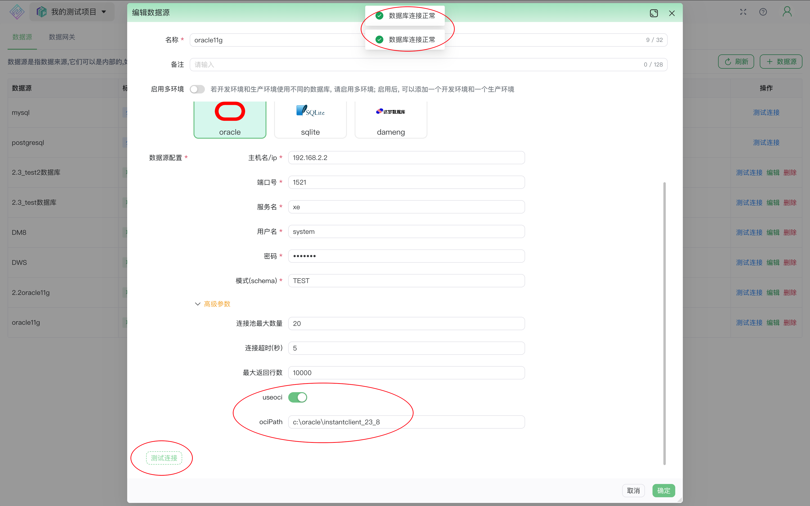
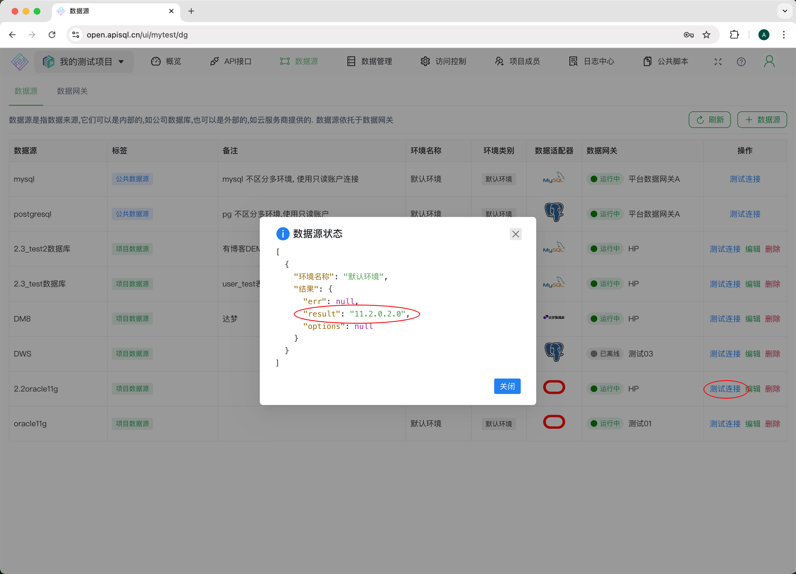

# 在 Windows 上安装 apiSQL 网关 v2 并连接 Oracle

本文档将指导您完成在 Windows 操作系统上安装 apiSQL 网关 v2.0，并详细说明如何配置网关以连接不同版本的 Oracle 数据库（包括 11g, 12c, 18c, 19c 及以上）。

> 该版本现只适用于apiSQL云平台，不适用于私有部署版本。
> 
## 安装apiSQL网关

1.  **下载安装程序**
    - [apiSQLgw2_Setup.exe](https://minio.hy.yyimen.com:89/store-p/apiSQL/gw/apiSQLgw2_Setup.exe)

2.  **运行安装**
    执行下载的 `.exe` 文件，按照向导完成安装。
    

    > **重要提示：** 安装过程中，您将获得`网关ID`和`网关Token`。为避免手动输入时产生错误，建议您直接**复制**和**粘贴**这两个值。

3.  **完成安装与自动启动**
    安装完成后，apiSQL 网关会注册为一个 Windows 服务并自动在后台启动。

## 验证网关状态

网关启动需要几分钟时间来初始化并从网络下载所需的 Node.js 运行时。

1.  **检查服务状态**
    打开 Windows 的“服务”应用，找到 `apiSQLgw2` 服务，确认其状态为“正在运行”。
    

2.  **检查进程**
    打开任务管理器，您应该能看到 `apiSQLgw2.exe` 进程。
    

3.  **在平台查看状态**
    等待约一分钟后，登录您的 apiSQL 平台，进入数据网关页面。刷新后，您应该能看到刚刚安装的网关节点显示为“运行中”状态，表示网关已成功连接到平台。
    

## Oracle连接模式

apiSQL 网关支持两种模式连接 Oracle，您需要根据您的 Oracle 数据库版本选择正确的模式：

-   **Thick 模式 (厚客户端)**
    -   **适用版本：** Oracle **19c** 及更早版本 (如18c, 12c, 11g)。
    -   **要求：** 必须安装 **Oracle Instant Client**，并配置PATH。优点是无需再安装任何版本的JDK、JRE。

-   **Thin 模式 (瘦客户端)**
    -   **适用版本：** Oracle **20c** 及更高版本。
    -   **要求：** **无需**安装任何额外的 Oracle 客户端软件。

如果您的数据库是 Oracle 20c 或更高版本，则无需进行额外配置，可以直接在 apiSQL 平台的数据源管理中创建 Oracle 数据源。

接下来的步骤将重点介绍 **Thick 模式**的配置。

## 配置Oracle 19c及以下

### 4.1. 下载并安装 Oracle Instant Client

您需要根据网关服务器的操作系统来选择合适的 Instant Client 版本。

-   **对于 Windows 10, Windows Server 2012 及更高版本:**
    1.  **下载 Instant Client:** 推荐使用最新版本，可从 Oracle 官网免登录下载。
        - [Instant Client for Windows (x64)](https://download.oracle.com/otn_software/nt/instantclient/instantclient-basic-windows.zip)
    2.  **安装依赖:** 最新版的 Instant Client (如 21c, 23c) 需要 Microsoft Visual C++ 2015-2022 运行库。
        - [VC++ Redistributable 下载](https://aka.ms/vs/17/release/vc_redist.x64.exe)

-   **对于 Windows 7, Windows Server 2008:**
    1.  **确保系统已更新:** 运行网关要求 `advapi32.dll` 版本不低于 `6.1.7601`。如果版本过低，请安装 [KB3080149 补丁](https://www.microsoft.com/zh-cn/download/details.aspx?id=48636)。
    2.  **下载 Instant Client:** 建议使用 **18.5** 版本
        - [Oracle Instant Client 选择下载18.5 (要登陆Oracle，点同意下载)](https://www.oracle.com/database/technologies/instant-client/winx64-64-downloads.html)
        
    3.  **安装依赖:** 18.5 版本需要 Microsoft Visual C++ 2013 运行库。
        - [VC++ 2013 Redistributable 下载](https://learn.microsoft.com/en-us/cpp/windows/latest-supported-vc-redist?view=msvc-170)
    

### 4.2. 配置环境变量

1.  **解压 Instant Client**
    将下载的 Instant Client 压缩包解压到一个固定的、无中文或特殊字符的路径。例如：`C:\oracle\instantclient_23_8`。

2.  **设置 PATH 环境变量**
    将解压后的 Instant Client 目录路径（如 `C:\oracle\instantclient_23_8`）添加到系统的 `PATH` 环境变量中。
    

### 4.3. 在 apiSQL 平台中配置并测试

1.  **进入数据源配置**
    在 apiSQL 平台，进入“数据源管理”页面，新建或编辑一个 Oracle 数据源。

2.  **启用 OCI 模式**
    在“高级参数”部分：
    -   勾选 **`useOci`** 选项以启用 Thick 模式。
    -   在 **`ociPath`** 输入框中，填写您在上一步中配置的 Instant Client 完整路径。

    

3.  **测试连接**
    
    点击 "测试连接" 按钮，系统将提示：数据库版本号，表明您的网关已成功连接到 Oracle 数据库。

