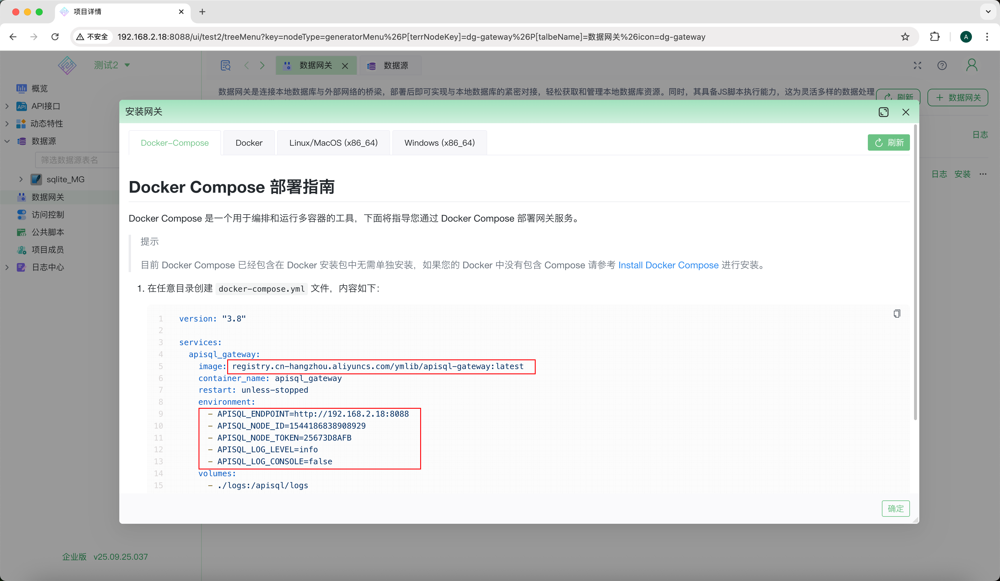
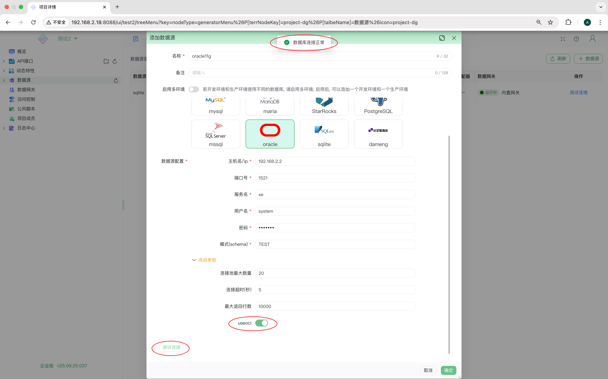

# 在 Linux 上安装 apiSQL 网关 v2 并连接 Oracle 数据库

本文档旨在指导您如何在 Linux 操作系统的 Docker 环境中成功安装 apiSQL 网关 v2，并详细阐述如何配置该网关以支持与不同版本的 Oracle 数据库（包括 11g、12c、19c 等）的连接。

> **注意**：此版本的网关仅适用于私有部署的 apiSQL 专业版和企业版，暂不支持 apiSQL 云平台。

## 安装apiSQL网关

首先，您需要获取网关的 `网关ID` 和 `网关Token`。



然后，在您的服务器上任意目录创建一个 `docker-compose.yml` 文件，内容如下。对比之前版本 镜像地址变化 和 环境变量统一增加了 `GW` 后缀。

```yml
version: "3.8"

services:
  apisql_gateway_02:
    image: registry.cn-hangzhou.aliyuncs.com/ymlib/apisql-gateway2:v2.10
    container_name: apisql_gateway_02
    restart: unless-stopped
    environment: 
      # apiSQL 平台地址
      - APISQLGW_ENDPOINT=http://<您的私有部署apiSQL平台地址>
      # 从 apiSQL 平台获取的网关 ID
      - APISQLGW_NODE_ID=<粘贴您的网关ID>
      # 从 apiSQL 平台获取的网关 Token
      - APISQLGW_NODE_TOKEN=<粘贴您的网关Token>
      # 日志级别，可根据需要调整
      - APISQLGW_LOG_LEVEL=debug
      # Node.js 内存限制
      - NODE_OPTIONS=--max-old-space-size=8192
    volumes:
      - ./logs_02:/apps/gw2/logs
```

最后，在 `docker-compose.yml` 文件所在的目录中执行以下命令来启动网关服务：

```bash
docker-compose up -d
```

## 配置Oracle数据源

网关启动后，请返回 apiSQL 平台进行数据源的配置和测试。

1.  **进入数据源配置页面**
    
    在 apiSQL 平台中，导航至“数据源管理”页面，然后选择新建或编辑一个 Oracle 数据源。

2.  **根据 Oracle 版本进行配置**

    -   **Oracle 20c 及更高版本**：
        直接填写数据库连接信息即可，无需额外配置。

    -   **Oracle 19c 及更早版本（例如 18c、12c、11g）**：
        需要启用 OCI (Thick) 模式。请在“高级参数”部分勾选 **`useOci`** 选项。
        
        

3.  **测试连接**
    
    完成配置后，点击“测试连接”按钮。如果一切正常，系统将提示“数据库连接正常”，表明您的网关已成功连接到 Oracle 数据库。

